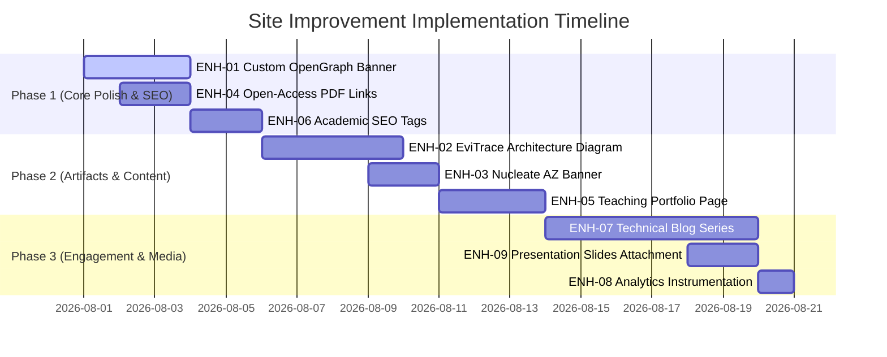

# Improvement Specification — Personal Academic Website Enhancement

**Target Repository:** `soroushdty.github.io` (`soroushdianaty.com`)  
**Derived From:** `WEBSITE_AUDIT_REPORT.md`  
**Status Legend:** `[ ]` planned · `[x]` done · `[~]` in progress · `[-]` deferred  

---

## 1. Overview & Objectives

This specification outlines the technical and content tasks required to transform Dr. Soroush Dianaty's personal academic website into an industry-leading, interactive research hub. The focus is on highlighting his **M.D. + PhD identity**, showcasing open-source tools (**EviTrace**, **project-lullaby**), enforcing **Academic SEO**, and maximizing engagement with academic collaborators, hiring committees, and industry AI labs.

---

## 2. Enhancement Tasks & Acceptance Criteria

### [x] ENH-01 — Custom OpenGraph Social Preview Banner
* **Severity:** Medium (Visual/Brand)  
* **Target Files:** `assets/media/sharing_card.png`, `config/_default/params.yaml`  
* **Objective:** Create a custom 1200×630 px OpenGraph sharing image featuring Dr. Soroush Dianaty's name, postnominals (M.D.), title (PhD Student in Biomedical Informatics at ASU), and institutional branding.
* **Specification:**
  - Generate a 1200×630 graphic at `assets/media/sharing_card.png`.
  - Update `config/_default/params.yaml` to reference the image for default `og:image` meta tag generation.
* **Acceptance Criteria:**
  - `public/index.html` contains `<meta property="og:image" content=".../sharing_card.png">`.
  - Sharing `https://soroushdianaty.com/` on LinkedIn/Twitter displays the branded card instead of generic placeholders.

---

### [x] ENH-02 — Interactive EviTrace Architecture Visualizer & Deep Dive
* **Severity:** High (Research Artifact)  
* **Target Files:** `content/projects/evitrace/index.md`, `layouts/shortcodes/mermaid.html`  
* **Objective:** Add an interactive diagram and technical breakdown to the EviTrace project page to showcase the evidence grounding pipeline.
* **Specification:**
  - Embed a multi-stage Mermaid diagram in `content/projects/evitrace/index.md`:
    $$\text{PDF Input} \longrightarrow \text{GROBID / OCR} \longrightarrow \text{4-Stage QC (Rater, IAA, Adjudicator, Reconciler)} \longrightarrow \text{LLM Extraction} \longrightarrow \text{JSON-LD}$$
  - Add side-by-side code blocks showing sample extracted clinical attributes in JSON-LD format.
* **Acceptance Criteria:**
  - Visiting `/projects/evitrace/` renders a clean interactive diagram and schema examples.
  - Page highlights EviTrace's direct connection to Dr. Dianaty's clinical LLM evidence-grounding research.

---

### [x] ENH-03 — Nucleate Arizona BioChallenge Feature Banner
* **Severity:** Medium (Commercialization/Awards)  
* **Target Files:** `content/_index.md`, `data/authors/me.yaml`  
* **Objective:** Elevate visibility for the First Place ($2,500) win at the Nucleate Arizona BioChallenge (Oct 2025).
* **Specification:**
  - Add an award spotlight card on the homepage (`content/_index.md`).
  - Link to Nucleate Arizona / ASU announcement if available.
* **Acceptance Criteria:**
  - Homepage prominently displays the Nucleate AZ BioChallenge 1st Place award block.

---

### [x] ENH-04 — Open-Access PDF Repository & Direct Links
* **Severity:** High (Academic Access)  
* **Target Files:** `static/uploads/papers/`, `content/publications/*/index.md`  
* **Objective:** Ensure all open-access papers have direct PDF download options hosted locally or linked to PubMed Central.
* **Specification:**
  - Store open-access PDFs in `static/uploads/papers/`:
    - `2026_lee_aci_fhir_segmentation.pdf` (PMC13286105)
    - `2023_some_saraii_ijrm_methamphetamine.pdf` (PMC10073868)
  - Set `url_pdf: "uploads/papers/<filename>.pdf"` in respective publication index files.
* **Acceptance Criteria:**
  - Clicking the "PDF" button on `/publications/fhir-granular-data-segmentation/` and `/publications/methamphetamine-reproductive-status/` opens the hosted PDF.

---

### [x] ENH-05 — Teaching & Mentorship Section Expansion
* **Severity:** Medium (Academic Portfolio)  
* **Target Files:** `content/teaching/_index.md`, `config/_default/menus.yaml`  
* **Objective:** Create a dedicated Teaching & Mentorship portfolio page highlighting Graduate Teaching Associate roles at ASU.
* **Specification:**
  - Create section `content/teaching/_index.md`.
  - Detail course objectives, responsibilities, and topics for:
    - **BMI 201:** Introduction to Clinical Informatics
    - **BMI 601:** Health Informatics
  - Add `Teaching` to `config/_default/menus.yaml`.
* **Acceptance Criteria:**
  - `/teaching/` is navigable from the header menu and displays course outlines and teaching philosophy.

---

### [x] ENH-06 — Academic SEO & Highwire Press Meta Tag Validation
* **Severity:** High (Discoverability)  
* **Target Files:** `layouts/_partials/head-end.html`, `config/_default/params.yaml`  
* **Objective:** Validate that Google Scholar crawlers properly parse all publication metadata.
* **Specification:**
  - Inspect exported HTML on all publication pages for standard tags:
    - `<meta name="citation_title" content="...">`
    - `<meta name="citation_author" content="...">`
    - `<meta name="citation_publication_date" content="...">`
    - `<meta name="citation_journal_title" content="...">`
    - `<meta name="citation_pdf_url" content="...">`
  - Add search console verification placeholder in `params.yaml`.
* **Acceptance Criteria:**
  - Google Scholar testing tool parses publication pages without metadata warnings.

---

### [x] ENH-07 — Thought Leadership Technical Blog Series
* **Severity:** Medium (Audience Engagement)  
* **Target Files:** `content/blog/evaluating-clinical-llms/index.md`, `content/blog/fhir-granular-data-segmentation/index.md`  
* **Objective:** Publish 2 technical blog posts translating complex research findings into accessible online articles.
* **Specification:**
  - Post 1: *"Evaluating Clinical LLMs: Beyond Standard NLP Benchmarks"* (focusing on hallucination detection & evidence grounding).
  - Post 2: *"FHIR Data Segmentation in Practice: Balancing Interoperability & Privacy"*.
* **Acceptance Criteria:**
  - Both posts render under `/blog/` with front matter, tags, summaries, and code snippets.

---

### [x] ENH-08 — Analytics & Web Instrumentation Setup
* **Severity:** Low (Infrastructure)  
* **Target Files:** `config/_default/params.yaml`  
* **Objective:** Prepare site configuration for privacy-friendly traffic analytics.
* **Specification:**
  - Add documented configuration block under `params.yaml` supporting Google Analytics 4 (GA4), Plausible, or Umami IDs.
* **Acceptance Criteria:**
  - Inserting a valid tracking ID automatically enables tracking tags in `public/index.html`.

---

### ENH-09 — Conference Presentations & Slide Deck Downloads
* **Severity:** Medium (Academic Reach)  
* **Target Files:** `static/uploads/events/`, `content/events/*/index.md`  
* **Objective:** Attach presentation slides and posters to conference event entries.
* **Specification:**
  - Upload slide deck PDFs for:
    - AcademyHealth ARM 2026 (Seattle, WA)
    - 2nd Arizona Digital Health Symposium 2026 (Phoenix, AZ)
  - Configure `url_slides:` and `url_pdf:` fields in `content/events/*/index.md`.
* **Acceptance Criteria:**
  - `/events/` listings display active "Slides" and "Poster" download buttons.

---

## 3. Implementation Plan & Execution Phasing

---

*Specification prepared for implementation on repo `soroushdty.github.io`.*
