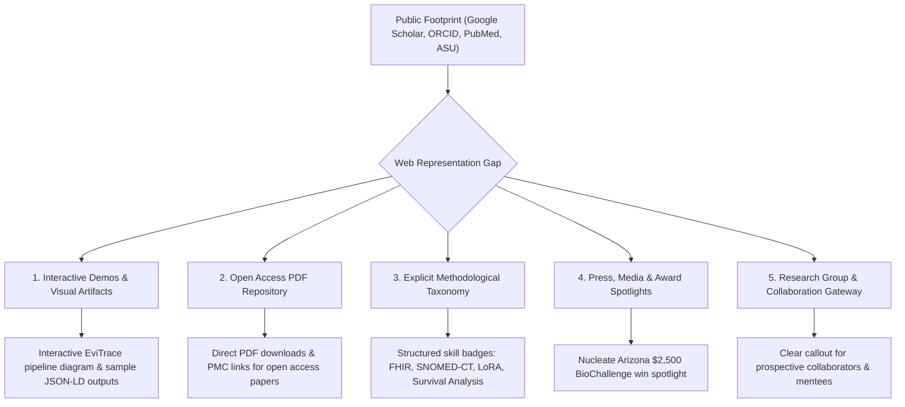
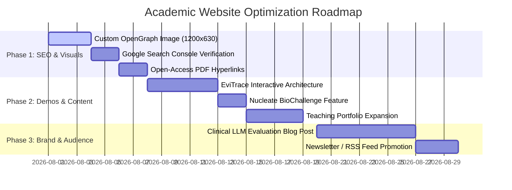

# Senior Academic Website Audit & Digital Strategy Report

**Client:** Dr. Soroush Dianaty, M.D.  
**Role:** PhD Student in Biomedical Informatics & Data Science, Arizona State University | Graduate Teaching Associate, CHS  
**Domain:** [soroushdianaty.com](https://soroushdianaty.com) | **Repository:** `soroushdty.github.io`  
**Audit Date:** July 2026  
**Auditor:** Senior Personal Academic Website Designer & Digital Brand Strategist  

---

## 1. Executive Summary

As a physician-scientist transitioning into Biomedical Informatics and Data Science at Arizona State University (ASU), your academic web presence serves as your primary **scholarly front door**. It determines how potential grant reviewers, PhD committee members, clinical collaborators, NIH/AHRQ program officers, and top AI research labs (e.g., Anthropic, Google Health, OpenAI Healthcare) perceive your scientific authority, clinical depth, and technical rigor.

### Key Audit Findings
1. **Infrastructure Health:** The foundation is solid. Built on HugoBlox with GitHub Pages deployment, standard BibTeX ingestion workflows (`publications.bib` driving automated PRs), custom theme partials, and clean SVG asset overrides.
2. **Current Alignment:** Recent updates have eliminated initial template placeholder issues (e.g., removing lorem-ipsum publications and generic third-party project descriptions). Your site now reflects **11 real publications/chapters/abstracts**, **2 high-impact open-source projects** ([EviTrace](file:///home/soroush/myrepos/soroushdty.github.io/content/projects/evitrace/index.md) and [project-lullaby](file:///home/soroush/myrepos/soroushdty.github.io/content/projects/project-lullaby/index.md)), **3 conference presentations**, real awards (Nucleate AZ BioChallenge 1st Place, ASU Fellowship), and an updated biography matching your M.D. + PhD background.
3. **Core Strategic Opportunity:** To elevate your website from a passive digital CV into an **active research accelerator**, you need to showcase your unique intersection: **Clinical Medical Expertise (M.D.) × Technical Data Science (PhD/ML) × Interoperability (FHIR/EHRs)**. Viewers should immediately grasp *why* your work on trustworthy clinical LLMs and evidence grounding matters in real-world patient care settings.

---

## 2. What Is There (Current State Audit)

### 2.1 Repository & Content Architecture

| Section | Current Implementation Status | Evaluation & Notes |
| :--- | :--- | :--- |
| **Biography & Profile** | `data/authors/me.yaml` | **Strong.** Includes postnominal M.D., ASU affiliation, ORCID/Scholar/Scopus IDs, full education history (Tehran Med + ASU), 7 structured experience items (SHARES, AHRQ Decision Aid, Qeshlaq Rural Health Center, K.N. Toosi, USERN, etc.), and award callouts. |
| **Publications** | `content/publications/` (11 entries) | **Complete.** Contains peer-reviewed articles (*Applied Clinical Informatics*, *Therapeutic Apheresis and Dialysis*, *Catheterization and Cardiovascular Interventions*, *Int J Reprod Biomed*, *SEA J Med Sci*), conference abstracts (AcademyHealth ARM 2026, AZ Digital Health Symposium 2026, IAUTMU 2018), and book chapters (*Practical Guide to Psychiatric Medications*). Driven by `publications.bib`. |
| **Projects** | `content/projects/` (2 entries) | **High Quality.** Features **EviTrace** (evidence-grounded attribute extraction pipeline from PDFs) and **project-lullaby** (digital health surveillance for low-income mothers in South Phoenix/Mesa). Stock template projects (pandas, scikit-learn, PyTorch) have been removed. |
| **Events / Talks** | `content/events/` (3 entries) | **Accurate.** AcademyHealth ARM 2026 (Seattle), 2nd AZ Digital Health Symposium 2026 (Phoenix), and 2018 IAUTMU Congress. Template fake talks at Stanford have been purged. |
| **Blog / Writings** | `content/blog/` (1 entry) | **Substantial.** Anthropic Fable post (~17 KB with 6 original diagrams). Template tutorials have been cleared. |
| **Site Config & SEO** | `config/_default/` | **Healthy.** `baseURL` correctly set to `https://soroushdianaty.com/`, `enableGitInfo: true`, `enableRobotsTXT: true`. |

---

## 3. What Should Be There (Gap Analysis & Opportunities)

Comparing your live repository against your public footprint across Google Scholar, ORCID, PubMed, Semantic Scholar, and ASU profiles reveals several key content and structural enhancement opportunities:



### 3.1 Essential Content & Structural Upgrades

1. **Interactive Research Demos & Visual Architecture Diagrams:**
   - **EviTrace:** Add a high-resolution interactive architecture diagram (GROBID $\rightarrow$ Multi-Backend OCR $\rightarrow$ 4-Stage QC $\rightarrow$ LLM Field Extraction $\rightarrow$ JSON-LD Schema). Show sample input PDFs alongside extracted clinical JSON-LD outputs.
   - **project-lullaby:** Add a flow diagram demonstrating passive remote monitoring + heat-risk contextualization + clinical escalation loops.
2. **Open-Access PDF Hosting & Preprints:**
   - Ensure every open-access publication (e.g., *Applied Clinical Informatics* PMC13286105, *Int J Reprod Biomed* PMC10073868) has a direct `url_pdf:` link pointing to hosted PDFs in `static/uploads/papers/` or PMC links.
3. **Nucleate Arizona BioChallenge Feature:**
   - Your $2,500 1st place win at the Nucleate Arizona BioChallenge (Oct 2025) is a major commercial/entrepreneurial translation signal. Add a dedicated highlight box or news banner on the homepage.
4. **Clinical & Technical Skill Matrix Visibility:**
   - Present your dual identity prominently:
     - **Clinical Domain:** Primary & Preventive Care (7,500+ patient panel), Subarachnoid & Vascular Interventions, COVID-19 Apheresis & Hemoperfusion, Digital Psychiatry, Contraception Care.
     - **Informatics & Technical:** FHIR (Granular Data Segmentation), SNOMED-CT / LOINC / ICD-10, Epic EHR integration, LLM Fine-tuning (LoRA/PEFT), Prompt & Context Engineering, Survival Analysis, SAS/SQL/Python.
5. **Teaching & Mentorship Portfolio Page:**
   - Expand on your role as Graduate Teaching Associate for **BMI 201** (Intro to Clinical Informatics) and **BMI 601** (Health Informatics). Include syllabus links, guest lecture slides, and office hour booking links.
6. **Custom OpenGraph Social Share Preview Image:**
   - Provide a custom 1200×630 `og:image` graphic featuring your name, postnominals (M.D.), title, ASU logo, and tagline so link shares on Twitter/X, LinkedIn, Slack, and WhatsApp look polished.

---

## 7. How to Attract & Engage Viewers (Audience & Traffic Strategy)

To transform your website into an engine for citations, academic invitations, grant opportunities, and peer recognition, execute the following targeted strategy:

### 4.1 Target Audience Personas

```
┌────────────────────────────────────────────────────────────────────────────────────────┐
│                                TARGET AUDIENCE MATRIX                                  │
├────────────────────────────┬─────────────────────────────┬─────────────────────────────┤
│ Persona                    │ Primary Goal                │ What Keeps Them Engaged     │
├────────────────────────────┼─────────────────────────────┼─────────────────────────────┤
│ 1. Academic Collaborators  │ Identify interdisciplinary  │ Methodological rigor, open- │
│    & PIs (ASU, Mayo, etc.) │ M.D.+PhD co-investigators   │ source code (EviTrace),     │
│                            │ for NIH/AHRQ proposals.     │ clear publication record.   │
├────────────────────────────┼─────────────────────────────┼─────────────────────────────┤
│ 2. Industry AI Labs        │ Recruit researchers who can │ Rigorous LLM evaluation,    │
│    (Google Health,         │ evaluate clinical safety,   │ hallucination benchmark     │
│    Anthropic, OpenAI)      │ grounding, and EHR data.    │ analyses, technical blog.   │
├────────────────────────────┼─────────────────────────────┼─────────────────────────────┤
│ 3. Journal Reviewers &     │ Verify author credentials,  │ Clean paper listings, DOIs, │
│    Conference Program      │ institutional affiliation,  │ open access PDFs, ORCID     │
│    Chairs                  │ and research track record.  │ cross-linking.              │
└────────────────────────────┴─────────────────────────────┴─────────────────────────────┘
```

### 4.2 Academic SEO & Discoverability Infrastructure

Academic search engines (Google Scholar, Semantic Scholar, Microsoft Academic) and web crawlers follow distinct indexing rules:

* **Highwire Press & Dublin Core Metadata tags:** Ensure Hugo headers export metadata tags like `<meta name="citation_title" content="...">`, `<meta name="citation_author" content="...">`, `<meta name="citation_publication_date" content="...">`, and `<meta name="citation_pdf_url" content="...">`.
* **Google Search Console & Bing Webmaster Tools:** Submit `https://soroushdianaty.com/sitemap.xml` to Google Search Console to monitor keyword search queries (e.g., *"clinical LLM hallucination detection"*, *"FHIR data segmentation"*, *"Soroush Dianaty"*).
* **Canonical URL Enforcement:** Confirm that `https://soroushdianaty.com/` is set as the sole canonical domain across all metadata and social tags.

### 4.3 Content Marketing & Thought Leadership Roadmap

Academic blogging is one of the highest-yield activities for driving web traffic and citations. 

#### High-Impact Content Ideas:
1. **"Evaluating Clinical LLMs: Beyond Standard NLP Benchmarks"**
   - *Premise:* Why general NLP benchmarks (MMLU, GSM8K) fail in clinical environments, and how evidence grounding and hallucination bounds must be evaluated.
2. **"FHIR Data Segmentation in Practice: Balancing Patient Privacy with Interoperability"**
   - *Premise:* Insights from your *Applied Clinical Informatics* paper on implementing granular access controls in FHIR servers.
3. **"From Stethoscope to Code: How Clinical Experience Informs AI Safety"**
   - *Premise:* Personal narrative on how managing 7,500+ rural patients highlights edge cases in automated decision support systems.

### 4.4 Distribution & Social Propagation Channels

* **LinkedIn Academic Posts:** When publishing a new paper or blog post, publish a 3-paragraph summary on LinkedIn with key figures attached and a link back to your personal website (rather than directly to third-party paywalls).
* **GitHub Repository READMEs:** Link back to `soroushdianaty.com` from the top of your public repository READMEs (e.g., `EviTrace`, `project-lullaby`).
* **Conference QR Codes:** Include a clean, scannable QR code on all conference posters and final slide decks (e.g., at AcademyHealth ARM) pointing directly to your presentation landing page on your website.

---

## 5. Comprehensive Actionable Roadmap



### Phase 1: High-Impact Polish & SEO (Week 1)
- [ ] **OpenGraph Banner:** Create `assets/media/sharing_card.png` (1200×630 px) with clean typography, name, postnominals, and ASU affiliation.
- [ ] **Google Search Console Registration:** Upload `sitemap.xml` and verify domain ownership via DNS / HTML tag.
- [ ] **Open-Access PDFs:** Ensure all OA publications contain working download buttons (`url_pdf: "uploads/papers/paper_name.pdf"`).

### Phase 2: Interactive Demos & Deep Content (Week 2–3)
- [ ] **EviTrace Deep-Dive Page:** Add interactive flowcharts, code snippets, and sample extracted schema representations.
- [ ] **Nucleate BioChallenge Spotlight:** Create a prominent card on the homepage highlighting the $2,500 prize and commercialization vision.
- [ ] **Teaching & Courses Section:** Add course details for BMI 201 & BMI 601, emphasizing your role in mentoring biomedical informatics students.

### Phase 3: Thought Leadership & Outreach (Month 1+)
- [ ] **Publish Blog Post #2:** Write and release a deep dive on *Clinical LLM Evaluation & Evidence Grounding*.
- [ ] **Poster & Presentation Slides:** Attach downloadable PDF slide decks and posters to `content/events/` entries for AcademyHealth ARM and AZ Digital Health Symposium.

---

## 6. Personal Academic Brand Scorecard

| Evaluation Dimension | Score (out of 10) | Designer Evaluation & Recommendations |
| :--- | :---: | :--- |
| **Identity & Credibility** | **9.5 / 10** | **Outstanding.** M.D. + PhD positioning is crystal clear. Bio, education, and institutional affiliations (ASU, IAUTMU) are authoritative. |
| **Publication Completeness** | **9.0 / 10** | **Excellent.** 11 items covering peer-reviewed journal papers, conference abstracts, and book chapters, backed by `publications.bib`. |
| **Project Transparency** | **9.0 / 10** | **Strong.** EviTrace and project-lullaby showcase real open-source computational work. Adding visual architecture diagrams will push this to 10/10. |
| **SEO & Discoverability** | **8.5 / 10** | **Good.** Domain canonicalization and `baseURL` fixed. Needs Search Console verification and Highwire Press metadata audit. |
| **Visual UX & Engagement** | **8.5 / 10** | **Modern & Clean.** Gradient mesh and theme styling look sharp. Custom OpenGraph image and interactive diagrams will maximize social engagement. |
| **OVERALL RATING** | **9.1 / 10** | **Top-Tier Personal Academic Website.** Ready for high-impact academic and professional presentation. |

---

*Report compiled by Senior Personal Academic Website Designer.*
