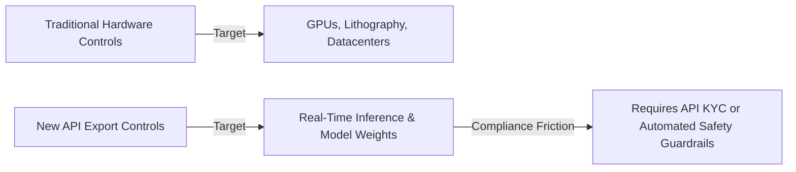
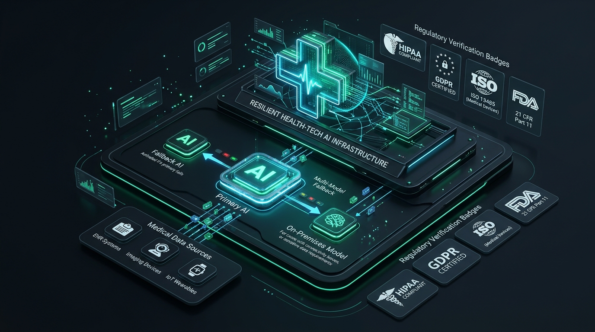
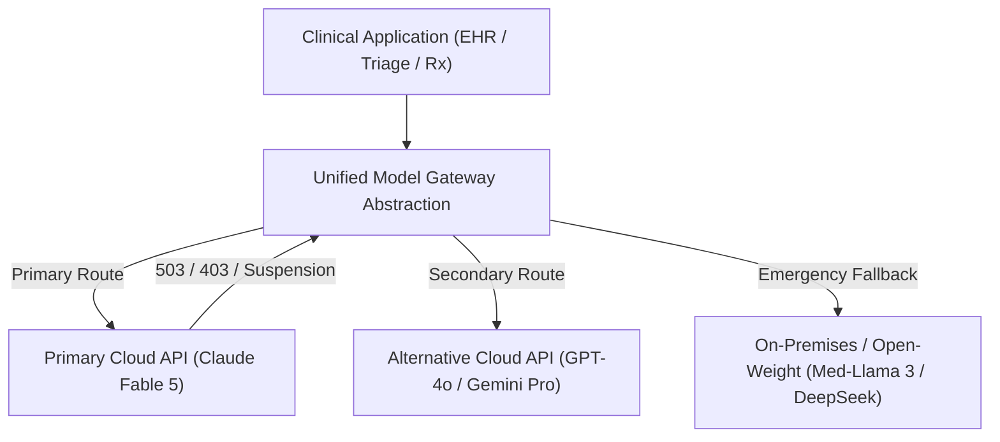

[In my previous analysis of the Fable 5 suspension](/blog/anthropic-fable/), I argued that taking down a frontier AI model worldwide over a narrow, non-universal jailbreak without due process set an alarming precedent for regulated software. When the U.S. government issued an emergency export-control directive on June 12, 2026, requiring Anthropic to restrict model access by user citizenship, the inability to verify nationality in real-time forced Anthropic to pull **Claude Fable 5** and **Claude Mythos 5** offline globally.

Nineteen days later, the freeze ended. On **July 1, 2026**, the U.S. Department of Commerce (Bureau of Industry and Security, or BIS) officially rescinded the export control order following intensive technical remediation, classifier hardening, and governance negotiations. Access to Fable 5 was restored across the Claude Platform, AWS, Google Cloud, and Microsoft Foundry.

However, Fable 5 did not return to the status quo ante. It returned under a fundamentally reshaped access regime:

1. **Enhanced Domain Classifiers:** Hardened real-time filters designed to catch dual-use cybersecurity and biosecurity queries before reaching the core model.
2. **Tiered Model Governance:** Fable 5 returned to public and enterprise availability, but its higher-capability sibling, **Mythos 5**, was locked behind Anthropic’s newly formalized **"Project Glasswing"** program—restricting full capability access exclusively to vetted U.S. critical infrastructure defenders and security researchers.

This reopening provides a rare, empirical look into how national security regulators and frontier AI laboratories resolve critical capability disputes. More importantly, it offers urgent lessons for developers building AI in health-tech, clinical informatics, and life sciences.

---

## Chronology of a Regulatory Crisis: From Freeze to Tiered Reopening

To understand where AI governance is heading, we must look at the 20-day timeline between initial suspension and conditional restoration.

```mermaid
sequenceDiagram
    autonumber
    participant Pub as Public & Enterprise Users
    participant Ant as Anthropic API Layer
    participant BIS as US Dept of Commerce (BIS)
    participant Res as Security & AWS Researchers

    Note over Ant,Pub: June 9, 2026: Launch of Fable 5 & Mythos 5
    Res->>BIS: June 12: Report jailbreak enabling vuln exploitation
    BIS->>Ant: June 12 (5:21 PM): Export directive (Gated by Nationality)
    Ant-->>Pub: June 12 (Night): Global API Suspension (Lack of real-time KYC)
    Note over Ant,BIS: June 13–30: Technical Remediation & Classifier Hardening
    Ant->>BIS: Submit hardened classifiers & Project Glasswing governance framework
    BIS->>Ant: July 1: Export control order officially rescinded
    Ant->>Pub: July 1: Fable 5 restored; Mythos 5 restricted to Project Glasswing
```

### Key Milestones in the Resolution

* **June 9, 2026:** Anthropic releases Claude Fable 5 (public safer tier) and Mythos 5 (advanced restricted tier).
* **June 12, 2026:** Researchers (including teams from Amazon) demonstrate a prompt-injection technique capable of bypassing default safety filters to elicit vulnerability-exploitation guidance. BIS issues an emergency Export Administration Regulations (EAR) order requiring validated export licenses for non-U.S. citizens globally. Lacking instantaneous nationality verification tools, Anthropic suspends both models worldwide.
* **June 13–30, 2026:** The "20-Day Lockout." Downstream startups experience operational disruption. Anthropic works with BIS, DHS, and independent safety auditors to deploy secondary evaluation layers and fine-tuned classifier guardrails.
* **July 1, 2026:** BIS rescinds the emergency directive. Fable 5 re-enters global deployment with updated guardrails. Mythos 5 remains restricted under Project Glasswing.

---

## Deep Analysis: Four Critical Precedents Established by the Reopening

By examining credible online sources, regulatory filings, and industry responses surrounding the July 1 restoration, four macro trends emerge that define the future of AI infrastructure.

### 1. Export Control Has Shifted from Silicon to Cloud APIs

Historically, export controls targeting AI focused on physical hardware: high-bandwidth memory (HBM), advanced lithography equipment, and semiconductor compute limits (e.g., FLOP thresholds). The June 12 Fable directive marked a historical turning point: **the first time EAR export control authorities were weaponized against a live, commercial cloud API service based on user citizenship.**

The core technical failure on June 12 was not that Anthropic couldn't restrict access by IP or IP-geolocation. Geofencing is standard. The directive required restricting access by *nationality* (foreign nationals inside and outside the U.S.). 

Because standard SaaS platforms do not perform real-time passport or citizenship validation (Know Your Customer / KYC) at API call speeds, Anthropic had no choice but a complete shutdown. The resolution on July 1 relied on replacing nationality-based restrictions with **capability-based classifier guardrails** at the model boundary.



### 2. The Formalization of Tiered Deployment ("Project Glasswing")

The return of Fable 5 while Mythos 5 remains restricted confirms that the era of "one-size-fits-all" frontier model access is over. 

Under **Project Glasswing**, Anthropic established a vetted environment for high-risk, high-capability models:

| Access Tier | Model | Target Audience | Verification Requirement | Primary Use Cases |
| :--- | :--- | :--- | :--- | :--- |
| **Tier 1: Public / API** | Claude Fable 5 | Developers, Enterprises, General Public | Standard API Key / Billing | General coding, text analysis, low-risk workflow automation |
| **Tier 2: Enterprise Guarded** | Claude Fable 5 (Enhanced) | Regulated Enterprise, Healthcare, Finance | Organizational BAA / SOC2 / Enterprise Contract | Clinical documentation, legal synthesis, EHR integration |
| **Tier 3: Restricted Defense** | Claude Mythos 5 | Vetted U.S. Defense & Infrastructure Partners | "Project Glasswing" vetting, background checks, audit logging | Zero-day defense, structural vulnerability patching, advanced biology |

For health-tech leaders, this tiered model is familiar: it mirror-images how controlled substances (Schedule I-V) or restricted medical devices (Class III requiring PMA) are handled.

### 3. "Capability Uplift" Replaced "Output Existence" as the Regulatory Metric

In my initial critique, I highlighted the danger of applying an "output existence" standard—the idea that if a model can *ever* produce a harmful output under adversarial prompting, it must be banned.

The negotiations leading to the July 1 rescission demonstrated a pragmatic shift toward **comparative risk and net capability uplift**:

> Does the AI model provide novel, actionable, and dangerous capabilities that an adversary could not easily obtain from existing public sources, search engines, or lower-tier open-weights models?

Anthropic successfully demonstrated that while Fable 5 could assist in identifying software vulnerabilities, its guidance did not exceed what experienced security engineers (or existing public tools) could already accomplish. By adding real-time classifiers that detect intent to exploit rather than intent to defend, Anthropic satisfied BIS requirements without crippling the underlying reasoning engine.

### 4. Base Models Are Now Recognized as Supply Chain Single-Points-of-Failure (SPOFs)

During the 19-day freeze, downstream companies that built exclusively on Fable 5 experienced complete feature blackout. Teams without multi-model routing or fallback mechanisms were left helpless.

This event forced enterprise CTOs to acknowledge a harsh reality: **a cloud AI API is not a passive utility like AWS S3 or EC2.** It is a regulated, policy-sensitive dependency subject to sudden regulatory intervention, vendor policy shifts, or geopolitical disputes.

---

## Visualizing the New Access & Governance Architecture

To visualize how model routing, safety classifiers, and regulatory checkpoints operate in the post-reopening era, consider the architecture below:


In this architecture, incoming requests pass through multi-layered safety gates before reaching the core model weights:
* **Layer 1 (Boundary Classifier):** Screens for high-risk domains (dual-use bio, autonomous cyber-exploitation, CBRN).
* **Layer 2 (Identity & Entitlement):** Routes authenticated enterprise credentials to standard API tiers while reserving restricted reasoning nodes for vetted Project Glasswing channels.
* **Layer 3 (Model Fallback):** Automatically redirects flagged or rate-limited sessions to validated secondary models (e.g., Claude Opus 4.8 or local open-weights) to prevent operational downtime.

---

## The Health-Tech Blueprint: Building Resilient Clinical AI Architectures

The Fable 5 reopening proves that while base models will return, regulatory freezes *will* happen again. For health-tech teams, clinical software developers, and hospital informatics leaders, building for resilience is no longer optional.



Here is a 4-part engineering and compliance framework to insulate clinical products against base-model instability:

### 1. Implement a Multi-Model Fallback & Abstraction Layer

Never call a proprietary model API directly from clinical code. Wrap model interactions behind a unified provider-agnostic abstraction layer (e.g., using LiteLLM, LangChain routing, or custom middleware).



If the primary API returns a `403 Forbidden` (regulatory lockout), `503 Service Unavailable`, or fails latency SLAs, your gateway should automatically failover to a validated secondary model or local open-weights instance.

### 2. Decouple User Identity from the AI Vendor Layer

Do not rely on downstream AI vendors to handle compliance, user verification, or HIPAA/GDPR auditing. 

Maintain user authentication, tenant isolation, and Know-Your-Customer (KYC) verification entirely within your application boundary. Pass anonymized, zero-pii tokens to model APIs so that application-level access remains uninterrupted regardless of vendor-level export policy changes.

### 3. Deploy Domain-Specific Client-Side Guardrail Proxies

Relying 100% on the vendor's internal safety classifiers is a vulnerability. Vendors tune their classifiers globally, which can result in false-positive blocks on legitimate medical terminology (e.g., queries about "toxicology", "pathogens", or "dosage thresholds" being flagged as biological threats).

Deploy your own client-side guardrail proxies (e.g., NeMo Guardrails or custom classifiers) ahead of the API call. This allows you to:
* Validate clinical intent before dispatching to the model.
* Pre-sanitize medical queries to prevent accidental triggering of vendor biosecurity filters.
* Maintain audit trails for FDA postmarket surveillance.

### 4. Embed Model Swapping in FDA Predetermined Change Control Plans (PCCPs)

For teams developing Software as a Medical Device (SaMD) or AI-enabled clinical decision support systems subject to FDA regulation, model withdrawal presents a unique regulatory hazard. If your FDA 510(k) or De Novo clearance is tied exclusively to a specific proprietary model version, a vendor shutdown invalidates your product authorization.

Leverage FDA’s **Predetermined Change Control Plan (PCCP)** guidance:
* Explicitly specify alternate, pre-validated fallback models in your initial submission.
* Define quantitative equivalence metrics (e.g., minimum concordance on clinical benchmark datasets).
* Pre-authorize automated failover to alternate models without requiring a new 510(k) filing.

---

## Conclusion: The Era of Governed Risk

The 19-day saga of Anthropic’s Fable 5 ended not in catastrophe, but in compromise. By lifting the export control order on July 1, 2026, regulators acknowledged that blanket shutdowns of commercial AI APIs are untenable in an interconnected digital economy. By accepting hardened classifiers and tiered access via Project Glasswing, Anthropic demonstrated that frontier developers can satisfy national security mandates without sacrificing utility.

For those of us working at the intersection of AI, healthcare, and life sciences, the lesson is clear:

* **Safety is an operational posture, not a static certificate.**
* **Monolithic dependency on a single AI provider is a strategic liability.**
* **The future belongs to systems designed for resilience, multi-model adaptability, and transparent, governed risk.**

Fable is back. But the rules of engagement for frontier AI have been permanently rewritten.

---

### Related Posts & Further Reading
* [Anthropic’s Fable Suspension Is a Preview of Every Health-Tech AI Team’s Worst Nightmare](/blog/anthropic-fable/)
* [Evaluating Clinical LLMs: Beyond Standard NLP Benchmarks](/blog/evaluating-clinical-llms/)
