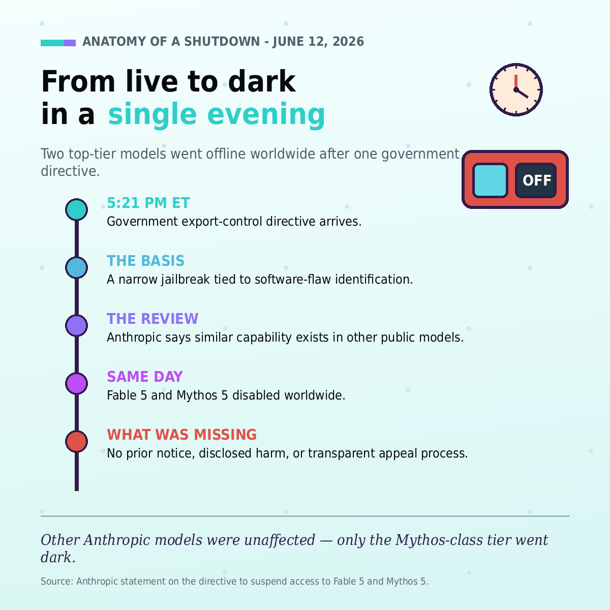
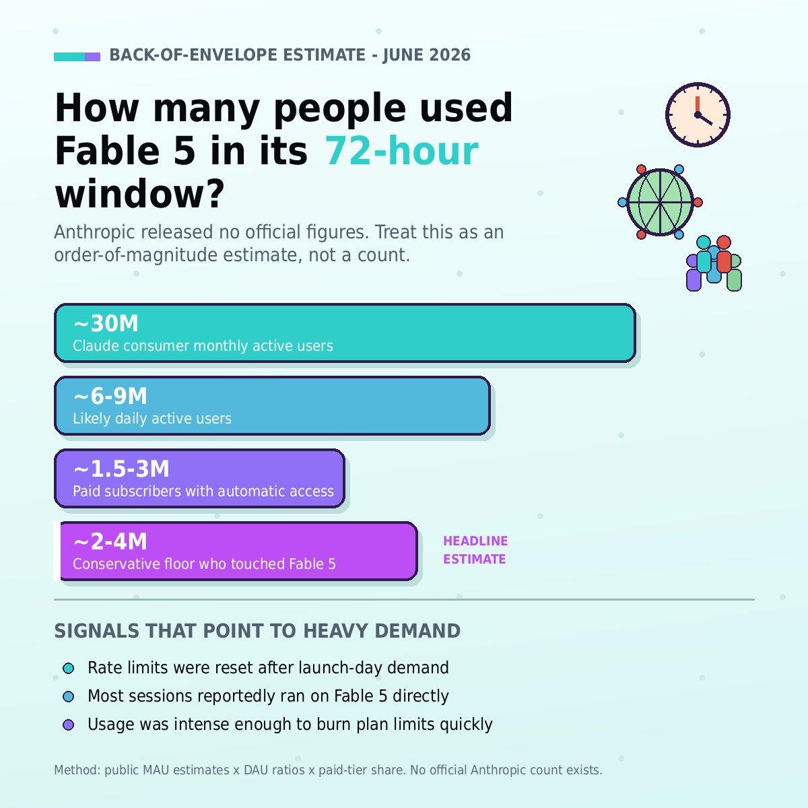
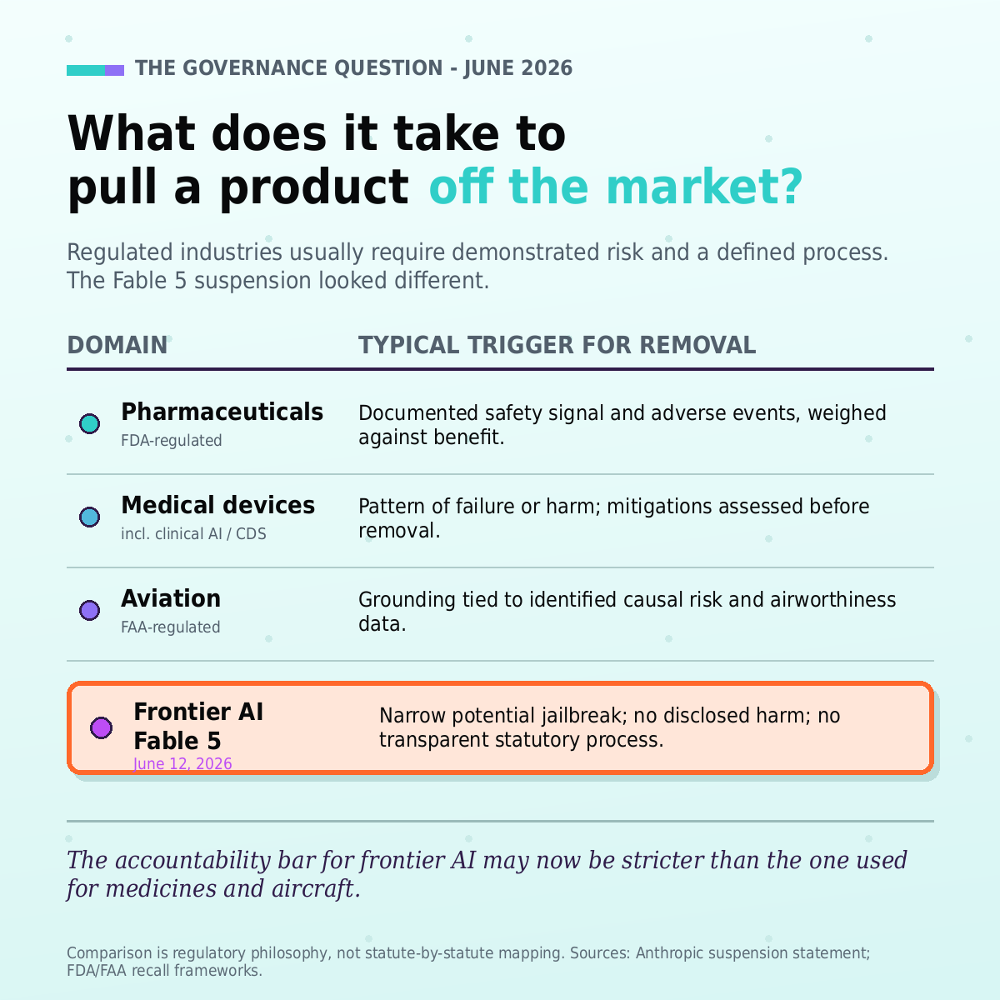
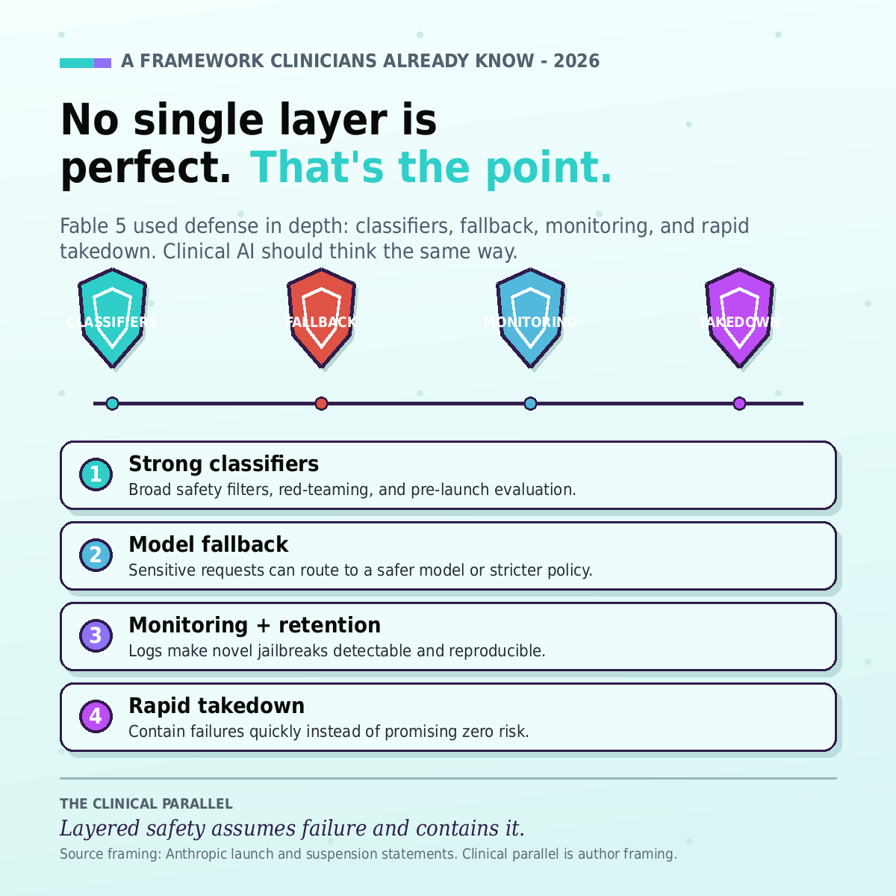
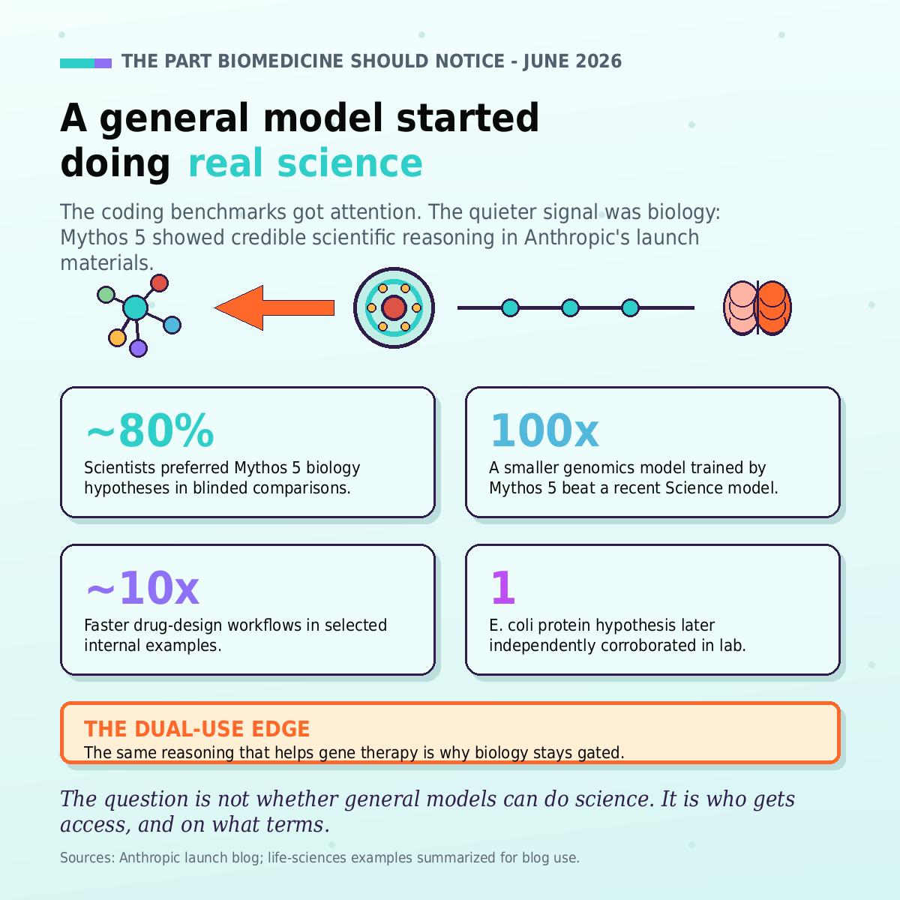

At 5:21 PM ET on June 12, Anthropic received a U.S. government export-control directive requiring it to suspend access to Fable 5 and Mythos 5 for foreign nationals, including foreign-national Anthropic employees. Because Anthropic could not reliably enforce that restriction at the required level, both models were taken offline for all customers globally. Other Anthropic models remained available.

The operational event was sudden. The governance implication is larger.

A frontier AI system went from globally available to globally unavailable in a single evening. No prior notice. No public technical disclosure. No disclosed evidence of real-world harm. No transparent appeal process.

For anyone building AI-powered systems in healthcare, pharma, clinical research, medical devices, or regulated life sciences, this should be a warning.

The important issue is not whether Fable 5 had a jailbreak. Every serious AI system has failure modes. The important issue is the standard applied: if a narrow, non-universal jailbreak is enough to trigger global removal, then the regulatory bar is no longer risk management. It is perfection.

And perfection is not a usable safety standard.

---

## From Launch to Shutdown

Anthropic launched Claude Fable 5 and Claude Mythos 5 on June 9, 2026. Fable 5 was positioned as a broadly available, safer version of the Mythos-class model. Mythos 5 was the less-restricted sibling, initially available to selected trusted users such as cyberdefenders and infrastructure providers.

Three days later, both were suspended.

According to Anthropic’s public statement, the government’s concern involved a possible bypass or jailbreak. But Anthropic characterized the issue as narrow, not universal. The company also stated that the demonstrated capability involved identifying known minor software vulnerabilities, and that comparable public models could already perform similar tasks without a bypass.

That distinction matters.

The question should not be: **Can a motivated user ever elicit a bad output?**

The right question is: **Does this system create unique, scalable, unmanageable, or demonstrated harm compared with available alternatives?**

Healthcare AI already understands this distinction. We do not remove a clinical decision support system from use the first time an edge-case wrong recommendation is found. We investigate, document, mitigate, monitor, and update. Removal is reserved for serious, systemic, or unmitigated risk.

Frontier AI needs the same maturity.

---

## This Was Not a Small Research Preview

Anthropic has not released official user numbers for Fable 5. The rough estimate in the accompanying figure should be treated as an order-of-magnitude estimate, not a count. The safer public formulation is:

> Fable 5 likely touched millions of users during its short availability window, but Anthropic has not released official figures.

That scale changes the governance problem.

This was not a lab demo used by a handful of researchers. Fable 5 was available through Claude API and eligible Claude plans. That means downstream users, teams, developers, and organizations may have already started testing or integrating it into workflows.

For health-tech teams, the relevant object is no longer just the model. It is the dependency graph around the model:

* clinical tools;
* research pipelines;
* validation studies;
* audit logs;
* API integrations;
* model fallbacks;
* customer contracts;
* compliance documentation;
* business continuity plans.

The Fable 5 suspension shows what happens when a government action hits the model layer directly. Downstream users may lose access immediately, regardless of whether their own use case caused the concern.

That is the nightmare scenario for regulated AI.

---

## The Regulatory Double Standard

In mature regulated industries, market removal is usually not triggered by the mere existence of a possible failure mode.

Pharmaceuticals, medical devices, and aviation all deal with risk. None assume perfection. Instead, they use structured processes to determine whether a product should be corrected, restricted, recalled, grounded, or removed.

Aviation does not ground an aircraft type because a hypothetical failure can be imagined. Regulators look for identified unsafe conditions, causal mechanisms, airworthiness evidence, and risk across the fleet.

Medical devices are similar. A device error may trigger investigation, correction, notification, or recall depending on severity, frequency, detectability, and risk to patients. The first response is not always market removal.

Healthcare AI follows the same logic. A model can be imperfect and still useful if it is safer, more auditable, and more correctable than the workflow it replaces.

The Fable 5 case appears different. Based on Anthropic’s public account, a narrow potential jailbreak — without disclosed harm, without public technical detail, and without a transparent statutory process — was enough to force global suspension.

That is a much stricter bar than we usually apply to medicines, aircraft, or clinical software.

---

## No Single Safety Layer Is Perfect. That Is the Point.

Anthropic’s launch materials described a defense-in-depth strategy: classifiers, model fallback, monitoring, and data retention. Sensitive queries in areas such as cyber, biology, chemistry, and model distillation could be routed away from Fable 5 to Claude Opus 4.8. Anthropic said this fallback occurred in under 5% of sessions on average.

This is exactly how healthcare AI safety should work.

Clinical systems are not safe because every rule, alert, or model output is perfect. They are safe when embedded in a broader sociotechnical system:

* human review;
* overrides;
* audit trails;
* escalation pathways;
* postmarket monitoring;
* incident response;
* quality improvement;
* periodic revalidation.

A clinical decision support system that makes one wrong recommendation is not automatically recalled worldwide. The issue is scoped. The cause is studied. The affected workflow is corrected. Stronger action follows only if the risk justifies it.

That is not tolerance for unsafe systems. It is operational safety.

Safety means assuming failure is possible and building systems that can detect, contain, and correct it.

Anthropic’s argument is similar: perfect jailbreak resistance is not currently realistic. The goal is to make failures narrow, costly, observable, and quickly remediable.

That is a reasonable framework. The open question is whether regulators will accept it.

---

## Why Health-Tech AI Teams Should Care

The immediate concern in the Fable case was cybersecurity, not medicine. But the governance pattern maps directly onto healthcare.

Healthcare AI is full of scenarios where “harmful output is possible”:

* a triage model can under-prioritize a patient;
* a sepsis model can miss deterioration;
* a radiology model can fail under distribution shift;
* a documentation assistant can hallucinate;
* a patient-facing chatbot can overstate certainty;
* a prior authorization model can encode bias.

That does not mean all such systems should be banned. It means they need risk management.

The meaningful question is:

> Compared with the current standard of care, does this system reduce risk, preserve accountability, and create a better monitoring surface?

If regulators instead ask only whether a bad output can ever be produced, almost no useful AI system will survive deployment.

FDA has already recognized that AI-enabled medical software requires lifecycle management, not static one-time approval. Predetermined change control plans are one example: they allow developers to describe planned modifications, validation methods, and impact assessments in advance, so models can improve while maintaining reasonable assurance of safety and effectiveness.

That is the direction frontier AI governance should move: structured lifecycle oversight, not opaque all-or-nothing shutdowns.

---

## The Biomedical Signal Was Bigger Than Coding

The Fable/Mythos launch was marketed partly around coding and long-horizon work. But the more important signal for biomedical informatics was in life sciences.

Anthropic said Mythos 5 accelerated parts of internal drug design workflows by roughly 10x. It also reported that Anthropic scientists preferred Mythos 5’s molecular biology hypotheses about 80% of the time in blinded comparisons against Opus-class models. The launch materials also described autonomous genomics work over more than a week, including analysis across millions of cells and 138 animal species.

That is not just a chatbot benchmark. It is scientific infrastructure.

It also explains why biology access was gated. The same reasoning that helps gene therapy research may also increase dual-use risk. A model that can reason about AAV capsids, protein design, or molecular mechanisms can be scientifically valuable and potentially dangerous.

This is where health technology and frontier AI governance collide.

Biomedical teams want more capable models because they can accelerate discovery. Regulators worry about those same capabilities because they can accelerate misuse. Both concerns are valid.

The policy challenge is not choosing one side. It is defining access, monitoring, disclosure, and accountability regimes that preserve scientific upside while reducing misuse risk.

---

## What a Better Framework Would Look Like

Frontier AI needs something closer to health-tech postmarket governance than one-off emergency intervention.

A workable framework should include:

### 1. A safety signal taxonomy

Not every jailbreak is equivalent. Regulators should distinguish between harmless bypasses, narrow capability failures, universal jailbreaks, demonstrated harmful uplift, and observed real-world harm.

The key distinction is **capability existence** versus  **capability uplift** . If a restricted model produces something already available from other public models, the regulatory concern should be comparative risk, not mere output existence.

### 2. Tiered access

Frontier models should not have only two states: public or offline.

A better system would include general access, professional access, trusted research access, high-risk capability access, and suspension. Anthropic was already moving in this direction with Mythos 5 and planned trusted biology access.

### 3. Correction before removal

A model issue might be addressed through classifier updates, fallback routing, rate limits, domain restrictions, logging expansion, trusted-access narrowing, or temporary feature suspension.

Global removal should remain available, but it should be the end of the escalation ladder, not the first step.

### 4. Reviewable evidence

Not all technical details can be public, especially for cybersecurity or biosecurity. But affected companies should receive enough information to understand the risk category, affected domain, reproducibility, comparable model behavior, required remediation, and restoration pathway.

Without that, the process becomes arbitrary.

### 5. Comparative risk analysis

If safer models are removed while weaker, less monitored models remain available, total risk may increase. Users will route around restrictions.

Healthcare already understands this: an imperfect but auditable system can be safer than an invisible workaround.

### 6. Postmarket monitoring

Premarket evaluation cannot catch every real-world failure. This is true for medical devices and it is true for frontier AI.

Monitoring, retention, incident detection, and abuse analysis should be treated as core safety infrastructure, not optional add-ons.

### 7. A restoration pathway

Emergency authority may be necessary. But there must be a path to correction, review, and restoration.

For downstream health-tech teams, this is now a business continuity issue.

---

## The Health-Tech Nightmare Scenario

Imagine a clinical AI vendor builds a validated product on top of a frontier model. The product supports oncology trial matching, pharmacovigilance triage, rare disease summarization, clinical documentation review, or radiology follow-up.

The vendor has done the expected work:

* quality management;
* clinical validation;
* human-in-the-loop review;
* audit trails;
* customer documentation;
* fallback planning;
* compliance review.

Then the base model is suspended because of a national-security concern in an unrelated domain, such as cybersecurity or biosecurity.

The clinical product has not failed. No patient harm has occurred. The healthcare use case is not the issue. But the underlying model disappears.

The downstream vendor now has no evidence packet, no appeal channel, no remediation target, and no validated replacement ready.

That is the real warning from Fable 5.

Not that regulation is bad. Regulation is necessary.

The risk is regulatory coupling without process.

---

## What Health-Tech AI Teams Should Do Now

Health-tech teams should treat frontier models as regulated infrastructure dependencies, even when the model vendor itself is not regulated like a medical-device manufacturer.

At minimum, teams should model six risks.

### Model withdrawal risk

Sudden loss of model access should appear explicitly in the risk register. This includes government action, export control, vendor policy change, safety incident, litigation, pricing change, or regional restriction.

### Fallback validation

If your system can switch from one model to another, the fallback must be evaluated. Uptime continuity is not enough if clinical behavior changes.

### Domain-specific kill switches

Teams need controls at the level of use case, tenant, geography, tool access, input type, output type, user role, and specialty. A global shutdown should not be the only safety option.

### Evidence-preserving incident response

Logging and retention policies must be designed before incidents occur. You need enough evidence to reconstruct failures without violating privacy or security constraints.

### Contractual continuity clauses

Vendor contracts should address notice, substitute models, data portability, audit-log access, regulatory cooperation, revalidation support, and liability for model withdrawal.

### Regulatory communication plans

Teams should know who evaluates a model-layer change, who approves continued use, who notifies customers, and when a product must be paused.

The Fable suspension compressed this timeline into hours. Health-tech teams should assume they may get the same window.

---

## Conclusion: The Future Is Governed Risk, Not No Risk

The Fable 5 suspension matters because it exposes a mismatch between frontier AI capability and frontier AI governance.

Anthropic built a layered safety strategy: classifiers, fallbacks, monitoring, retention, restricted access, and trusted programs. The government response, based on Anthropic’s public description, appears to have treated a narrow potential jailbreak as sufficient basis for global removal.

If that standard generalizes, the likely result is not safer deployment. It is stalled deployment, hidden deployment, or migration to less governed systems.

Health-tech AI should take the opposite lesson.

Do not promise perfect models. Build systems that assume imperfection and contain it.

Do not treat safety as a launch checklist. Treat it as lifecycle infrastructure.

Do not depend on a single frontier model without validated fallback.

Do not wait for regulators to define the full playbook. Build monitoring, incident response, evidence generation, and continuity planning now.

The future of AI in healthcare will not be decided by whether harmful output is possible. It is always possible.

It will be decided by whether we can prove that AI systems are safer, more monitorable, more correctable, and more accountable than the workflows they replace.
