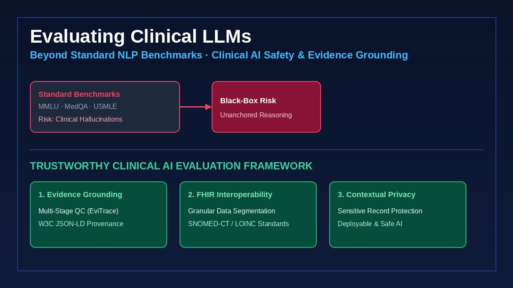
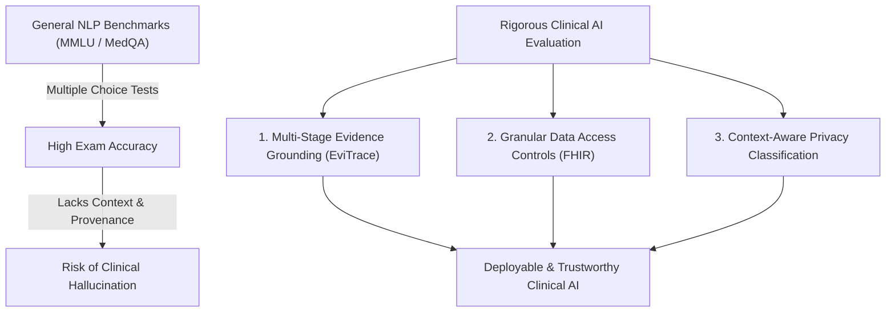

General-purpose Large Language Models (LLMs) continue to show impressive performance on standardized medical exams (such as USMLE question sets). However, achieving a high score on a multiple-choice exam is fundamentally different from providing **clinically safe, evidence-grounded, and context-aware guidance** in real-world patient care settings.

When an LLM is deployed in a hospital or clinic, a single plausible-sounding hallucination can lead to inappropriate treatment, delayed diagnoses, or compromised patient privacy.

<!--more-->

## The Limits of Standard NLP Benchmarks in Healthcare

Standard benchmarks like MMLU, MedQA, or GSM8K evaluate static knowledge retrieval and multi-choice reasoning. However, clinical environments present distinct challenges that these benchmarks miss:

1. **Unstructured & Dynamic Context:** Real patient charts contain fragmented clinical notes, lab trajectories, and temporal dependencies.
2. **Asymmetrical Risk:** In medicine, false positives and false negatives carry drastically unequal risks. A missing allergy alert is far more catastrophic than a redundant warning.
3. **Auditable Evidence Grounding:** Clinicians cannot rely on black-box predictions. Every clinical recommendation must cite specific, verifiable evidence from authoritative guidelines or patient EHR records.

## Three Pillars of Trustworthy Clinical AI

### 1. Multi-Stage Evidence Grounding
Rather than relying on single-pass generation, clinical AI pipelines must extract structured attributes from scientific literature and EHR data with auditable provenance. In our open-source project **EviTrace**, we implement a 4-stage quality control loop (*Rater $\rightarrow$ Inter-Annotator Agreement $\rightarrow$ Adjudication $\rightarrow$ Reconciliation*) to ensure that every output field is anchored in W3C JSON-LD metadata.

### 2. Context-Aware Sensitive Data Classification
Privacy is paramount. In our recent work presented at the *AcademyHealth Annual Research Meeting 2026*, we demonstrate how context-aware LLM architectures can accurately classify sensitive health records (such as substance use disorders or mental health records) under granular data segmentation rules.

### 3. Interoperability & Standards Compliance
AI tools must integrate directly with existing hospital EHR systems using open standards like **HL7 FHIR** and clinical terminologies (**SNOMED-CT**, **LOINC**, **ICD-10**). As shown in our research published in *Applied Clinical Informatics*, granular data segmentation in FHIR servers is critical for preserving patient consent while maintaining clinical utility.

---

## Conclusion & Future Directions

Building trustworthy clinical AI requires bridging the gap between computational data science and frontline medical practice. Moving forward, the focus must shift from chasing raw model scale to developing rigorous, domain-specific evaluation frameworks that guarantee safety, transparency, and evidence grounding.
