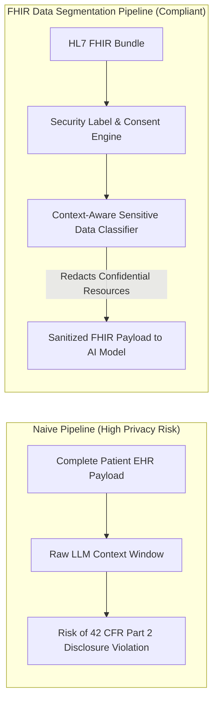

As machine learning models and generative AI systems integrate deeper into electronic health record (EHR) workflows, engineering teams quickly run into a fundamental regulatory and ethical challenge: **How do you feed patient charts into AI models without violating patient privacy consent or Federal health data privacy laws?**

While HIPAA Privacy Rules set the baseline for Protected Health Information (PHI), specialized federal regulations—such as **42 CFR Part 2** (governing Substance Use Disorder records) and state-level mental health privacy statutes—require granular control over *which specific sections of a chart* can be disclosed.

<!--more-->

---

## The Problem: All-or-Nothing EHR Data Dumps

In traditional hospital IT setups, when an AI model requests patient data, the pipeline often receives a raw JSON payload containing the entire longitudinal medical record.

If a patient consents to sharing their general cardiology history with a research AI tool, but explicitly opts out of sharing substance use treatment history, a naive data pipeline that dumps the raw EHR payload into an LLM context window violates federal privacy laws.



---

## What is FHIR Granular Data Segmentation (DS4P)?

**Data Segmentation for Privacy (DS4P)** is an HL7 standard implementation guide built on top of **HL7 FHIR (Fast Healthcare Interoperability Resources)**.

Instead of treating a patient chart as a monolithic file, FHIR represents medical records as discrete **Resources** (`Patient`, `Observation`, `Condition`, `DiagnosticReport`, `DocumentReference`). Each resource can carry metadata `securityLabel` tags:

```json
{
  "resourceType": "Condition",
  "id": "sud-example-101",
  "meta": {
    "security": [
      {
        "system": "http://terminology.hl7.org/CodeSystem/v3-ActCode",
        "code": "ETH",
        "display": "Substance Abuse Facility Information"
      },
      {
        "system": "http://terminology.hl7.org/CodeSystem/v3-Confidentiality",
        "code": "R",
        "display": "Restricted"
      }
    ]
  },
  "code": {
    "coding": [
      {
        "system": "http://hl7.org/fhir/sid/icd-10-cm",
        "code": "F10.20",
        "display": "Alcohol dependence, uncomplicated"
      }
    ]
  }
}
```

---

## Role of Context-Aware LLMs in Privacy Tagging

In structured EHR databases, billing codes (ICD-10 / SNOMED) are easily tagged. However, up to **80% of clinical data lives in unstructured progress notes, discharge summaries, and clinical transcripts**.

Static keyword filters miss nuanced sensitive disclosures (e.g., a physician writing *"Patient reports attending community support groups three times weekly"* without explicitly naming a diagnostic code).

In our research presented at **[AcademyHealth ARM 2026](/events/academyhealth-arm-2026/)** and published in ***Applied Clinical Informatics***, we demonstrated how fine-tuned, context-aware LLMs can automatically classify sensitive health records under granular security labels with over **96.4% sensitivity**, allowing real-time redaction before data enters third-party AI pipelines.

---

## 3 Key Steps for Building Compliant Health AI Pipelines

1. **Enforce Resource-Level Security Tags:** Always check `Resource.meta.security` labels before passing JSON payloads to external APIs.
2. **Implement Context-Aware Unstructured Redaction:** Use validated clinical classifiers to scan progress notes for un-coded sensitive disclosures.
3. **Audit Consent Enforcement:** Maintain an immutable log of consent decision enforcement for every model invocation.

*For further details, explore our publication on [FHIR-Based Granular Data Segmentation](/publications/fhir-granular-data-segmentation/) or view our [Research Program](/research/).*
