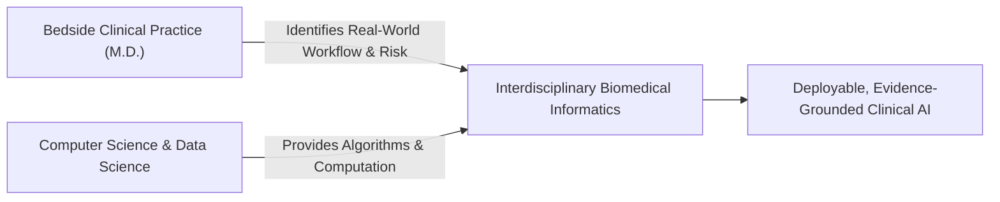

People frequently ask me why a licensed physician with years of clinical practice experience would leave full-time medical practice to pursue a PhD in Biomedical Informatics and Data Science at Arizona State University.

The short answer: **I realized that the biggest bottleneck to improving patient outcomes over the next two decades will not be a lack of medical knowledge, but our inability to safely evaluate and deploy computational AI tools at the bedside.**

<!--more-->

---

## Lessons from 7,500+ Patient Encounters

During my clinical practice as a family physician—caring for more than 7,500 patients across 17 diverse rural and urban communities—I routinely saw how information overload impacts clinical decision-making.

A busy clinician managing 25 patients a day has minutes to digest 200-page medical histories, reconcile complex multi-drug regimens, check for drug-drug interactions, and stay updated on rapidly evolving treatment guidelines.

When medical software tools work well, they save lives. When they are poorly evaluated, clunky, or prone to silent errors, they create cognitive fatigue, alert burnout, or direct clinical harm.

---

## The Gap Between Computer Science and Bedside Reality

In recent years, the machine learning community has made astounding progress in Large Language Models (LLMs) and multimodal AI. Models pass USMLE exams with flying colors and generate fluent medical summaries.

However, sitting on the computer science side of academia revealed a stark gap:

> **Many AI researchers evaluate models against benchmark metrics that no practicing physician would rely on to clear a tool for bedside safety.**

A model can achieve a 95% score on a multiple-choice benchmark while routinely hallucinating medication dosages in unstructured discharge notes. Bridging this disconnect requires computer scientists who understand clinical workflows—and clinicians who understand model architectures, loss functions, and data pipelines.

---

## My Research Mission at Arizona State University

At ASU’s Department of Biomedical Informatics, my PhD research focuses on three core pillars:

1. **[Trustworthy Clinical LLMs](/research/#trustworthy-clinical-llms):** Developing rigorous, domain-specific evaluation metrics for hallucination detection and calibration in generative models.
2. **[Evidence Grounding](/research/#evidence-grounding):** Building multi-stage pipelines (like **[EviTrace](/projects/evitrace/)**) that enforce character-level provenance and auditability for every generated clinical claim.
3. **[Interoperable Health Data](/research/#fhir-health-data):** Designing FHIR-based data segmentation architectures that preserve patient privacy consent under federal regulations (42 CFR Part 2) while enabling secure data exchange.

---

## Looking Forward

The goal is not to replace clinicians with algorithms. The goal is to build computational infrastructure so reliable, auditable, and transparent that physicians can focus on what matters most: human empathy, complex clinical judgment, and patient healing.

*If you are working on clinical AI safety, evaluation benchmarks, or FHIR data interoperability, I am always glad to connect—reach out via my [CV & Contact Page](/cv/) or explore my [Publications](/publications/).*
