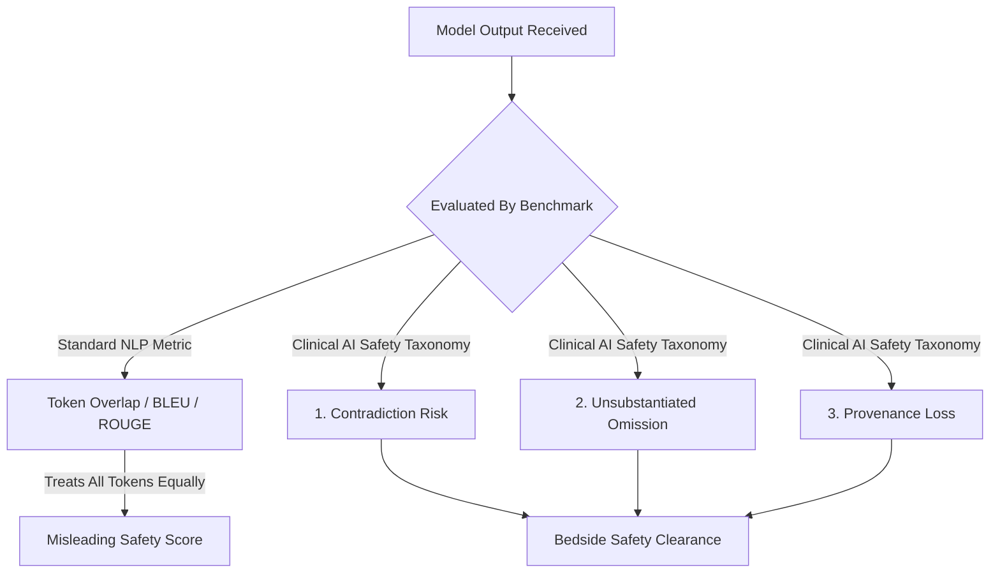

In general NLP, a "hallucination" is typically defined as any model output that is unfaithful to the source prompt or factually inaccurate according to a reference corpus. When evaluating Large Language Models (LLMs) for general chat or creative writing, benchmark evaluation suites measure hallucination rates using string overlap, ROUGE scores, or LLM-as-a-judge sentiment.

However, when applied to **clinical medicine**, this standard definition is dangerously incomplete.

<!--more-->

---

## Why Standard NLP Hallucination Benchmarks Fail in Healthcare

A model scoring 90% on a general benchmark (such as MedQA or USMLE multiple-choice datasets) sounds reassuring to AI product managers. But in a clinical workflow, **not all errors carry equal weight**.

Consider two hypothetical model outputs generated for an emergency department attending physician:

1. **Error A (Stylistic / Paraphrasing Error):** The model summarizes a lab result as *"Mildly elevated blood urea nitrogen observed"* when the chart stated *"BUN slightly above upper limit of normal."*
2. **Error B (Asymmetrical Clinical Risk Error):** The model omits a single line in a medication reconciliation summary: *"No known penicillin allergy"* when the chart listed a documented history of severe anaphylaxis to amoxicillin.

On standard NLP metrics (ROUGE-L, BLEU, or token similarity), Error A receives a penalty due to word choice mismatch, while Error B receives a near-perfect score because 98% of the words matched the chart correctly.

To a clinician, however, Error A is harmless stylistic variation, whereas Error B is potentially fatal.

---

## A 3-Tier Taxonomy of Clinical Hallucinations

To evaluate LLMs effectively for hospital and digital health deployment, we propose partitioning model hallucinations into three clinically distinct categories:

### 1. Direct Clinical Contradictions (Highest Risk)
An output that explicitly contradicts verifiable facts in the patient chart or established clinical guidelines.
- *Example:* Recommending Beta-blockers for a patient presenting with active severe bradycardia.

### 2. Unsubstantiated Inferences (Medium Risk)
An output that asserts a diagnosis, lab trend, or past medical history item that is neither stated in nor logically inferable from the available record, even if the statement happens to be plausible.
- *Example:* Stating a patient has "Type 2 Diabetes" based solely on a high BMI without a documented HbA1c or diagnostic code.

### 3. Provenance Loss & Omission (High Operational Risk)
An output that makes a correct clinical assertion but loses the verifiable audit trail (e.g., citing the wrong date, attributing a specialist note to the wrong provider, or omitting critical allergy/contraindication flags).

---

## Measuring Clinical Hallucinations with Evidence Grounding

At Arizona State University, our research focuses on moving beyond static multiple-choice benchmarks toward **evidence-grounded evaluation pipelines**.

In tools like **[EviTrace](/projects/evitrace/)**, we enforce character-level bounding-box provenance and 4-stage quality control loops (*Rater $\rightarrow$ IAA $\rightarrow$ Adjudication $\rightarrow$ Reconciliation*). By measuring the exact alignment between generated claims and W3C JSON-LD source metadata, we can calculate true **Clinical Grounding Precision (CGP)** rather than relying on uncalibrated text similarity.

---

## Conclusion & Actionable Takeaways for Health-Tech Teams

1. **Stop relying on USMLE exam scores as safety proof.** Exam passing scores measure static knowledge recall, not real-time clinical safety.
2. **Adopt asymmetric risk weighting.** Weight allergy omissions, dosage miscalculations, and temporal ordering errors heavily over stylistic differences.
3. **Require mandatory evidence provenance.** Every generated clinical recommendation must cite specific, verifiable source note offsets before being displayed to care providers.

*Read more about our ongoing research on [Trustworthy Clinical LLMs](/research/#trustworthy-clinical-llms) or explore our [Publications](/publications/).*
