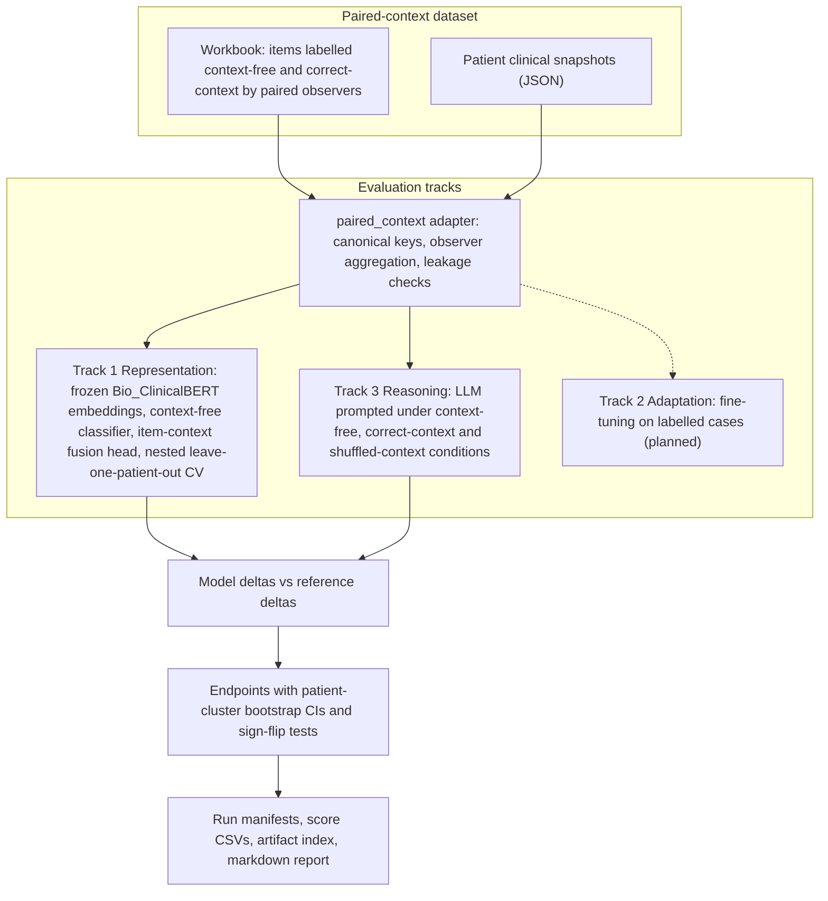

CAREBench is a research framework for studying how language models respond to patient-level clinical context when they classify sensitive EHR data. It runs on any dataset where human reviewers labelled the same items twice, first without and then with the patient's clinical snapshot. It measures how much a model's judgments move when context is added, and whether they move the same way the human judgments did.

<!--more-->

---

## At a Glance

| Attribute | Detail |
|---|---|
| **Status** | Early public release (v0.1.0, 2026-10-07). Developed privately January to June 2026, then released from a sanitized snapshot |
| **Role** | Creator, sole listed author and maintainer |
| **Domain** | Biomedical informatics: evaluation of language models for granular segmentation of sensitive health data |
| **License** | Apache-2.0 |
| **Repository** | [github.com/soroushdty/CAREBench](https://github.com/soroushdty/CAREBench) |
| **Version** | 0.1.0, with further changes listed as unreleased in the changelog |

---

## Background and History

CAREBench grew out of work in Dr. Adela Grando's **SHARES** project at Arizona State University on patient-controlled, granular segmentation of sensitive health data. Its paired design follows the study by Kaufman et al., in which physicians categorized EHR items first without and then with additional patient context.

The code began as the analysis pipeline for an earlier study on a small paired dataset, which included fine-tuned, context-aware models; an early version of that analysis was presented at the AcademyHealth Annual Research Meeting 2026. Because of the dataset's size and limitations, that study was not developed into a full paper. By then a substantial body of tooling had been built around it (developed in a private repository from January to June 2026, about 800 commits), so it was generalized into a dataset-agnostic framework: CAREBench as it is today. Fine-tuning returns in the framework as Track 2 (Adaptation). The public repository was created from a sanitized snapshot, so that study data and private development material are not in its git history; the short public commit history does not reflect the age of the code.

The repository contains code and a fully synthetic example dataset only. No data from any human-subjects study is distributed with it.

---

## Problem

When a clinician sees an EHR item (a diagnosis, a lab result, a medication) on its own, they may file it under one sensitive-data category. With the patient's chart in view, they may file it differently. Granular data segmentation depends on these judgments, and language models are increasingly considered for making them.

A model can respond to context in two ways. It can be **context-sensitive**: its output moves whenever a chart is added to the prompt. Or it can be **appropriately context-sensitive**: its output moves in the direction a clinician's judgment moves, and the movement disappears when the chart belongs to a different patient. Accuracy metrics do not separate these cases. A model can be accurate and still ignore context, or shift correctly while being poorly calibrated. CAREBench is built to measure the context shift itself.

---

## Research Question

> *Does a model change its privacy-category judgment when patient context is added, and do those changes match the human judgment shifts?*

The methodology breaks this into four questions:

1. Does the model's judgment change when patient context is added?
2. Does it change in the same direction as the human judgment?
3. Do the categories that shift most for humans also shift most for the model?
4. Does the alignment depend on the context belonging to *this* patient, or would any plausible clinical text produce it?

The framework is organized as a **functional analogy to physician decision-making**. Each track stands for one way a physician could reach a context-dependent judgment. The repository is explicit that this organizes the comparison and does not claim to model how physicians think.

| Track | Physician analogue | Question | Status |
|---|---|---|---|
| 1 – Representation | General clinical knowledge, before task-specific training | Is the context shift already latent in pretrained knowledge? | Available |
| 2 – Adaptation | Learning from supervised case experience | Can the shift be learned from labelled cases and carried over to new patients? | Planned ([#13](https://github.com/soroushdty/CAREBench/issues/13)) |
| 3 – Reasoning | Deliberating over the chart at decision time | Does the shift come from reasoning at decision time? | Available |

---

## Study Design the Framework Assumes

The built-in `paired_context` adapter expects a paired counterfactual design:

- A set of **patients**, each with a structured clinical snapshot (summary, history, medications, social history, labs, radiology, procedures).
- For each patient, a set of **items**: EHR strings drawn from that patient's record.
- **Reference observers** (for example, physicians working in fixed pairs) who label each item into sensitive-data categories twice: **context-free**, then **correct-context**.

The reference label for each (patient, item, category) is the mean of the observers' binary labels. With two observers it takes the values 0, 0.5 or 1, where 0.5 means the two observers disagreed, not a probability. The difference between the two conditions is the reference shift, Δ_ref. Each model is scored under the same conditions plus a negative control:

| Condition | Input | Role |
|---|---|---|
| `context_free` | Item text only | Baseline |
| `correct_context` | Item text plus this patient's snapshot | Treatment |
| `shuffled_context` | Item text plus a different patient's snapshot | Negative control |

The default label space is the ten sensitive-data categories used in SHARES: behavioral health, diagnoses, disabilities, infectious diseases, genetics, medications, sexual and reproductive health, social determinants of health, violence, and other.

---

## Architecture

The code is split into three packages with one-way dependencies, enforced by architecture tests:

- **`shared/`**: dataset-agnostic preprocessing, statistics, evaluation, and the adapter contracts.
- **`adapters/`**: translate a dataset into the framework's canonical objects. All dataset-specific column names, sheet names and labels live here; a new dataset needs a new adapter, not changes to the core.
- **`tracks/`**: the evaluation pipelines.



**Track 1 (Representation)** embeds items and context separately with a frozen clinical encoder. A context-free multilabel classifier is trained first, then a regularized linear fusion head combines item and context embeddings (several fusion options are configurable). All fitting uses nested leave-one-patient-out cross-validation, so every prediction is for a patient the model never saw. The fusion head is trained only to fit labels; nothing in its loss rewards agreement with the reference shift, so the endpoints are not optimized directly.

**Track 3 (Reasoning)** prompts an LLM with deterministic prompts (temperature 0 by default) under all three conditions and parses a JSON object of per-category scores. It supports Hugging Face, local `transformers`, and a `dry_run` backend that produces deterministic mock scores for pipeline testing. Responses are cached per model, condition, patient and item. There is no training.

Every run writes a run manifest, an adapter manifest, a resolved config and an artifact index, and the output contracts are checked by tests.

---

## How It Is Evaluated

The unit of analysis is the (patient, item) pair. Pairs from the same patient share a context snapshot and an observer group, so **the patient is the cluster**: intervals resample whole patients, and the effective sample size for between-patient claims is the number of patients.

Track 3 endpoints:

| Endpoint | Statistic | Uncertainty / test |
|---|---|---|
| **H1 – Context sensitivity** | Mean absolute model delta, overall and per category | Patient-cluster bootstrap 95% CI |
| **H2 – Directional alignment** | On cells where the reference shifted: sign agreement and signed alignment with the reference shift | Patient-cluster bootstrap 95% CIs |
| **H3 – Class-level correspondence** | Correlation of per-category mean model and reference shifts | One-sided permutation test |
| **H4 – Correct vs shuffled context** | Alignment under the correct patient's context minus alignment under another patient's context | Patient-cluster bootstrap CI; one-sided patient-cluster sign-flip test |

Track 1 tests directional alignment per category and pooled, and whether context lowers the Brier score against the correct-context labels, with Benjamini–Hochberg correction across categories. Confirmatory tests are limited to categories with at least 15 non-zero reference shifts; the rest are reported descriptively. Secondary outputs include agreement with each observer compared with observer–observer agreement (reported descriptively, with no equivalence claim), calibration error, entropy change, repeated vs novel items, and per-field context ablation.

Tests that compare cell-level values with zero use a **patient-cluster sign-flip test**, which flips each patient's contribution as a block and is exact when the number of patients is small. The methodology notes that the smallest attainable p-value is then 2^−(number of patients), for example 1/64 with six patients, and that this floor is a real limit of a small design rather than an artifact of the test.

The methodology document pairs each design choice with the pitfall it guards against: a shuffled-context control so any extra text is not mistaken for patient-specific context; a leakage check that stops a run if an item's text appears in its own patient's snapshot; text-standardization rules learned from training items only; and treating a 0.5 reference label as disagreement rather than a probability. In the repository's words, most of this machinery exists because a simpler version gave a misleading answer during development.

CAREBench does not measure classification accuracy, and this page reports no results. The repository does not yet publish results on real data.

---

## Getting Started

From the repository README (Python 3.10 or later):

```bash
python -m pip install -r requirements.txt
export PYTHONHASHSEED=42

# Track 3: LLM context-shift assay on the synthetic example, no LLM calls
python main.py --track reasoning -- --config configs/assay_config.yaml --dry_run --model dry_run_example
```

Track 1 on the synthetic example (the first run downloads the Bio_ClinicalBERT embedding model, about 440 MB):

```bash
python main.py --track representation -- --config configs/main_config.yaml
```

Track 3 with a real Hugging Face model (requires an `HF_TOKEN`):

```bash
python main.py --track reasoning -- --config configs/assay_config.yaml --model meta-llama/Llama-3.1-8B-Instruct
```

`PYTHONHASHSEED` must be set before Python starts for reproducible runs. To use your own data, the README points to `docs/data_format.md`; a launcher notebook is included for Colab, Jupyter or HPC.

---

## Status and Roadmap

**Available in 0.1.0**

- Track 3 (reasoning) and Track 1 (representation), both running end to end on the bundled synthetic dataset under continuous integration.
- The `paired_context` dataset adapter with configurable column and sheet names.
- A deterministic synthetic dataset and its generator, a post-hoc analysis bundle for Track 3 scores, reproducibility manifests, and pinned dependencies.

**Not yet available**

- Results on real data.
- Simulation studies of the endpoints' false-positive rate, power and interval coverage ([#18](https://github.com/soroushdty/CAREBench/issues/18)).
- Track 2, adaptation by fine-tuning on labelled cases ([#13](https://github.com/soroushdty/CAREBench/issues/13)).
- A context perturbation suite for the reasoning track, an auto-filled TRIPOD-LLM checklist per run, and multi-agent emulation of the paired-observer reference.
- Patient-grouped cross-validation shared across tracks, a shuffled-context control for Track 1, and a same-model comparison across tracks.
- A configurable label taxonomy, a second dataset format, and distribution-shift evaluation (blocked until a second paired-context dataset exists).
- FHIR/OMOP ingestion, standard terminology mapping, and hosted-API LLM backends.

---

## Limitations

From the repository's own documentation:

- **Synthetic data only.** The example dataset is invented. Results on it only show that the pipeline works and carry no scientific meaning. Dry-run outputs are mock scores and should never be reported as LLM performance.
- **Scope of claims.** Results describe the patients and reference observers in the evaluated dataset. With few patients, between-patient generalization is weak by construction, and the cluster bootstrap makes that visible in the interval widths.
- **Track 3 H1 and H2 lack a reference point.** Almost any model that reads the context will show a non-zero mean shift, and the chance level of the sign-agreement rate is not 0.5 when zero shifts count as disagreement. A shuffled-context reference is planned ([#17](https://github.com/soroushdty/CAREBench/issues/17)).
- **H3 has little power.** It is a correlation over the number of categories (ten by default) and is best read descriptively.
- **No simulation-based validation yet** of false-positive rates and power ([#18](https://github.com/soroushdty/CAREBench/issues/18)).
- **One label taxonomy and one dataset format** so far. The reasoning track's prompt and scoring assume the ten SHARES categories.

---

## Related Work on This Site

- [Early Evidence for Context-Aware Large Language Models (LLMs) in Sensitive Health Data Classification](/publications/context-aware-llm-sensitive-health-data/) (AcademyHealth ARM 2026): the earlier small-dataset study whose analysis tooling CAREBench generalizes.
- [Assessing the Effectiveness and Scalability of FHIR-Based Granular Data Segmentation Technology](/publications/fhir-granular-data-segmentation/) (*Applied Clinical Informatics*, 2026): SHARES work cited in the repository's origins.
- [FHIR Data Segmentation for Non-FHIR Engineers](/blog/fhir-data-segmentation-primer/): background on the data segmentation problem that CAREBench's label space comes from.
- [EviTrace](/projects/evitrace/): the planned multi-agent reference emulation in CAREBench is aligned with EviTrace's multi-agent roadmap.
- Research themes: [Trustworthy Clinical LLMs](/research/#trustworthy-clinical-llms) and [Interoperable Health Data and Granular Segmentation](/research/#fhir-health-data).
