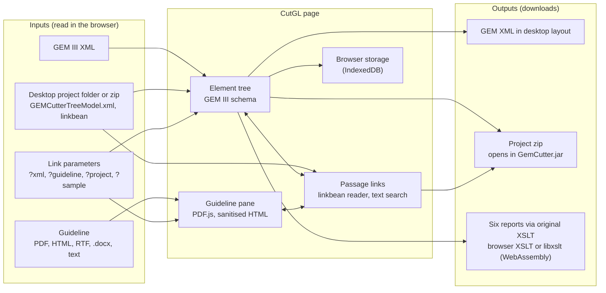

CutGL (Cutter for Guidelines) is GEM Cutter III as a web page. It shows a clinical guideline marked up as a Guideline Elements Model (GEM III, ASTM E2210) XML document side by side with the guideline it was cut from, and it can mark up new ones. Nothing needs to be installed, and the guideline and the markup stay in the browser.

<!--more-->

---

## At a glance

| | |
|---|---|
| **Status** | Early version (0.1.0). The code is public; a hosted version is not yet available. |
| **Role** | Author and maintainer. Written with Claude (Anthropic), as the README states; each commit carries a Claude co-author line. |
| **Origin** | A port of GEM Cutter III, a Java desktop application from the Yale Center for Medical Informatics (2012). Re-implemented in JavaScript from the desktop application's behaviour and file formats; none of its Java code is included. |
| **Domain** | Clinical practice guidelines, guideline knowledge representation (GEM III) |
| **License** | MIT for CutGL. The GEM III schema and the six report stylesheets from GEM Cutter III are included unchanged and are not covered by the MIT license; copyright stays with their authors. |
| **Repository** | [github.com/soroushdty/CutGL](https://github.com/soroushdty/CutGL) |


---

## Background

The Guideline Elements Model and GEM Cutter III are the work of the Yale Center for Medical Informatics. GEM III describes the parts of a clinical guideline (its identity, its recommendations, their conditions, decision variables, actions, evidence quality and strength, and so on) as elements of an XML schema. GEM Cutter III is the desktop application for "cutting" a guideline into that schema: a person selects a passage of the guideline and places it in the matching element of a tree, and the result is saved as a GEM XML document. The application also produced six reports from the marked-up document through XSLT stylesheets.

GEM Cutter III is a Java desktop program run from `GemCutter.jar`. CutGL keeps its file formats and reports and moves the work to a static web page.

---

## What CutGL does

### View a marked-up guideline

- Drop a GEM `.xml` file on the page, or open it from the Project menu. A GEM XML opened on its own starts in **View** mode: the editing tools are put away and **Filled only** hides the empty elements.
- The element tree shows each element's definition from the GEM III schema.
- The **Report** menu gives the original Recommendations, Detailed, Rules, Decision Variables, Actions and GEM-COGS reports.
- Attach the guideline the document was cut from, and **Link element text to passages** finds the text of each element in it and highlights the passages. **Edit** brings the tools back.

### Open a document from a link

A link can open a document directly, so a marked-up guideline can be put on a web page:

```
cutgl/?xml=guidelines/asthma.xml&guideline=guidelines/asthma.pdf
cutgl/?project=https://example.org/asthma_project.zip
cutgl/?sample=blood-pressure
```

`xml` is a GEM XML file and `guideline` (optional) the guideline it was cut from; `project` is a zipped project folder; `sample` is one of the three sample projects. Adding `&edit` opens the document in Edit mode. A file on another site opens only if that site allows it (CORS). A document opened from a link is not stored in the browser.

### Mark up a guideline

- **New project** from a guideline in PDF, HTML, RTF, Word `.docx` or plain text. The tree starts as the full GEM III schema, every element once.
- **Insert, Append, Replace, Clear** move the text selected in the guideline into the selected element, as in the desktop application. Text taken from the guideline is marked `explicit`, typed text is marked `inferred`, and the source can be set by hand.
- **Subtree** and **Delete** add or remove a copy of an element with its children.
- **Code sets** on `…Code` elements, fixed type lists on `ActionType` and `DirectiveType`, and drag and drop for `Conditional` and `Imperative` elements.
- A **logic window** for Conditional and Imperative recommendations, with If and Then panes, `( ) AND OR NOT`, and the decision variables and actions to click into place.
- **GEM II ⇒ GEM III** adds every element the GEM III schema defines that an older document lacks, in schema order.
- **Find** in the guideline ignores case, spacing, line breaks and hyphens, so a phrase is found even where a PDF wraps it.

### Passage links

Every element remembers where its text came from. Linked passages are underlined in the guideline, passages used by more than one element are shown in yellow, and clicking a passage selects its element. This also works for PDF guidelines, where the desktop application kept no record of where text came from.

**Link element text to passages** searches the guideline for the text of elements that have no link, for one element or for the whole tree. Each element is looked for beside the passages already linked around it (its recommendation, its neighbours), so a phrase that recurs, such as "Strong recommendation", lands on its own recommendation, and short text such as a date is linked only where it cannot be mistaken. According to the README, on the three sample projects it puts back every link as it was made by hand. It is also how a desktop PDF project gets its highlights back.

### Get the results out

- **Save project** downloads a zip in the desktop layout: the GEM XML, the tree model, the properties file, the guideline, and one extra file with the passage links.
- **Export GEM XML** and **View XML** give the document in the layout the desktop application writes.
- **Reports** are produced by the original XSLT stylesheets. A report can be saved as HTML, printed, or run with a modified stylesheet (Custom XSL).

---

## Compatibility with the desktop application

The desktop formats were worked out from projects written by GEM Cutter III, and are documented in the repository's `docs/formats.md`.

- **Project folders.** CutGL opens a desktop project folder (the one that holds `resources/`), a zip of it, or either dropped on the page. The tree comes from `GEMCutterTreeModel.xml`, the Swing tree the desktop application writes with `java.beans.XMLEncoder`. A GEM Cutter II project's links are read too.
- **Passage links from the desktop.** The desktop application stored links in `linkbean`, a Java-serialised list of link objects. CutGL includes a small reader for the Java object stream to recover each link's offsets and element. For plain-text and RTF guidelines it rebuilds the same text the desktop pane held, so the stored offsets apply directly. For HTML, the desktop counted characters differently from a browser, so CutGL looks for the element's text near the stored offset. For PDF, the desktop application stored offsets of `0`, so there is nothing to restore and the links are found again with **Link element text to passages**.
- **Saving back.** A project saved from CutGL, unzipped next to `GemCutter.jar`, opens in the desktop application. CutGL keeps its own passage links in `resources/cutgl.json`, which the desktop application ignores, and does not write `linkbean`, so the desktop application shows such a project without highlights.
- **GEM XML.** CutGL writes the document as the desktop application does: one element per line, no indentation, attributes in the same order. The README reports that the port was also checked against a real desktop project that is not in the repository, and that its exported XML was identical, character for character, to the file the desktop application had written.
- **Reports.** The GEM III schema and the six report stylesheets are the files from the GEM Cutter III distribution, unchanged. At run time CutGL changes two things without touching the files: it supplies the Detailed report's date, which the stylesheet used to request from a Yale server that is no longer available, and it runs two stylesheets that declare XSLT 2.0 (but use only 1.0 features) as XSLT 1.0.

The README lists where CutGL deliberately differs from the desktop application, including:

- passage links are kept for PDF guidelines and for text added with Append;
- typing in an element marks it `inferred` (the desktop application did so as soon as the text box was clicked), and Clear sets the source back to `nd`;
- new subtrees take the highest `id` in use for that element name plus one, where the desktop application counted from the start of each session, so ids could repeat after a restart;
- GEM II ⇒ GEM III completes the tree from the schema rather than a fixed list;
- Word `.docx` guidelines are accepted; old `.doc` files are not;
- projects live in the browser's storage and in the saved zip, not in a folder beside the program.

---

## How it works

CutGL is a static page with no build step: `index.html` and a few scripts. `src/core.js` holds the document model, the GEM III schema handling, GEM XML and the desktop tree model, and an RTF reader; `src/javaser.js` reads the desktop `linkbean` files; `src/app.js` is the interface. Libraries are loaded from a CDN the first time they are needed: PDF.js for PDF guidelines, JSZip for project zips, mammoth for `.docx`, and an XSLT replacement. Browsers are removing XSLT; where it is gone, the page loads libxslt compiled to WebAssembly so the reports still come out. HTML guidelines and report output are passed through an allow-list sanitiser before they are shown.



The repository includes a Playwright test suite that drives the real page in headless Chromium, with the CDN libraries served locally. Per the README, it covers the samples and demo folders, projects in the desktop formats, the six reports with both XSLT engines, tree editing, the logic window, taking text from a PDF, search, and narrow screens. Desktop-format test fixtures are written with the JDK's own classes, and all fixtures and samples are generated from invented text. Continuous integration runs the tests on pull requests.

The page has light and dark themes and shares GaitScope's palette, so the two tools read as one family. A script can also pack the page into a single self-contained HTML file for places that take one file.

---

## Privacy

Files are read in the browser and are not uploaded. The guideline and the markup do not leave the browser; the project being worked on is kept in that browser's storage until it is saved as a zip, and the zip is the copy to keep. A document opened from a link is fetched from that link and is not stored. The only other network requests are for the page's libraries (and the files they need) and its web font, loaded from public CDNs.

---

## Status

CutGL is at an early version (0.1.0). The source code is public on GitHub; a hosted version is not yet available. Locally it runs from any static file server, or by opening `index.html` from disk.

A later stage is planned in which a model would propose the GEM III markup of a guideline, as GEM XML, for a person to review in CutGL, with each element linked to its passage so that what the model copied, reworded or left out is visible beside the source. The review tools that stage needs are the ones described above; the part that would take a model's output is not built yet.

---

## Limitations

- PDF, zip, `.docx` and fallback XSLT support load libraries from a CDN the first time they are used, so those features need a network connection.
- Desktop PDF projects carry no passage positions; their links have to be found again by text search. Links in desktop HTML projects are placed by looking near the stored offset rather than by the offset itself.
- Projects saved from CutGL open in the desktop application without highlights, because CutGL does not write `linkbean`.
- Old Word `.doc` files are not accepted.
- The `id` values CutGL writes follow the desktop application's output, which does not satisfy the schema's `xs:ID` type.
- Browser storage is not a backup; the saved zip is.
- The three sample guidelines are invented for the demonstration and are not clinical guidance.

---

## Acknowledgements

- **GEM Cutter III** and the **Guideline Elements Model** are the work of the Yale Center for Medical Informatics. The GEM III schema and the six report stylesheets in CutGL come unchanged from the GEM Cutter III distribution and remain their authors'.
- CutGL uses PDF.js, JSZip, mammoth and an XSLT polyfill built on libxslt, loaded at run time.
- CutGL was written with Claude (Anthropic).

---

## Related work on this site

- [Evidence Grounding](/research/#evidence-grounding): the research theme of tying statements about clinical guidelines back to their source. CutGL's passage links show, for each GEM element, the guideline text it came from.
- [GaitScope](/projects/gaitscope/): CutGL uses GaitScope's palette and type, so the two tools read as one family.
