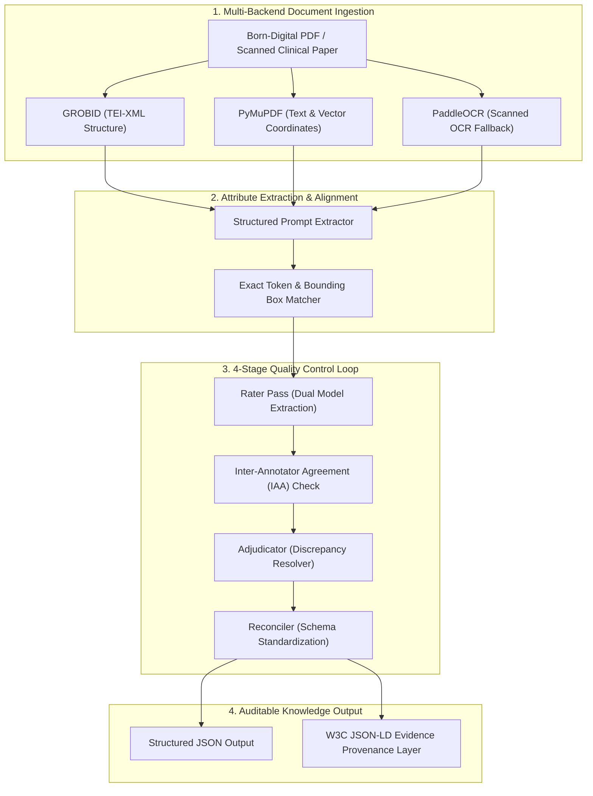

EviTrace is an open-source, automated research pipeline designed to extract structured clinical and scientific attributes from complex PDF literature while guaranteeing that **every single extracted attribute is explicitly anchored to verifiable source evidence** with exact page offsets, bounding polygons, and confidence scores.

<!--more-->

---

## Executive Overview & Case Study

| Attribute | Detail |
|---|---|
| **Project Status** | Active Research Pipeline (v1.2.0) |
| **Role** | Lead Architect & Developer (Soroush Dianaty, M.D.) |
| **Primary Domain** | Biomedical Informatics / Evidence Grounding in Generative AI |
| **License** | GPL-3.0 Open Source |
| **Repository** | [github.com/soroushdty/EviTrace](https://github.com/soroushdty/EviTrace) |
| **Last Updated** | July 26, 2026 |

---

## Problem Statement

When researchers and systematic review teams attempt to use Large Language Models (LLMs) to extract clinical data from published papers (e.g., sample sizes, dosage regimes, hazard ratios, cost-effectiveness thresholds), **standard single-pass LLM prompts suffer from subtle, high-risk hallucinations**.

A model might correctly identify a hazard ratio of `1.42` but silently attribute it to the wrong sub-cohort, or extract a p-value from a discussion section hypothesis rather than the primary statistical results table. In clinical guidelines synthesis and comparative-effectiveness research, ungrounded extractions undermine scientific integrity and patient safety.

---

## Research Question

> *Can a multi-stage LLM extraction pipeline achieve human-expert precision on heterogeneous clinical PDFs while embedding machine-readable, W3C-compliant audit trails for every extracted data point?*

---

## Methods & System Architecture

EviTrace decouples document ingestion from attribute extraction and enforces strict multi-model consensus before committing any value to the final dataset.

### Pipeline Flowchart



### Technical Highlights

1. **Multi-Backend Ingestion:** Combines `GROBID` for structural XML parsing of headers and tables, `PyMuPDF` for exact spatial bounding boxes, and `PaddleOCR` for legacy scanned figures or legacy clinical charts.
2. **4-Stage Quality Control (QC):**
   - **Rater Pass:** Runs parallel extractions using distinct model architectures (e.g., Claude 3.5 Sonnet + Llama-3 70B).
   - **IAA Check:** Calculates automated Cohen's $\kappa$ and semantic embedding distance across extracted fields.
   - **Adjudicator Pass:** Automatically routes conflicting fields to a high-reasoning referee model with targeted source snippets.
   - **Reconciler Pass:** Standardizes unit expressions (e.g., converting `mg/dL` to `mmol/L` or mapping outcome terms to SNOMED-CT / LOINC).
3. **Auditable JSON-LD Provenance Layer:** Every field output contains exact character offsets, bounding box coordinates `[x0, y0, x1, y1]`, page numbers, and verbatim text quotes.

---

## Sample Auditable Output (JSON-LD)

Below is an actual JSON-LD annotation generated by EviTrace demonstrating explicit evidence grounding for a health economics attribute:

```json
{
  "@context": "https://schema.org/",
  "@type": "MedicalStudy",
  "name": "Cost-Effectiveness of Post-COVID Interventions",
  "studySubject": "COVID-19 Survivors",
  "extractedAttribute": {
    "name": "Incremental Cost-Effectiveness Ratio (ICER)",
    "value": "$14,250 / QALY",
    "evidenceProvenance": {
      "pageNumber": 4,
      "boundingPolygon": [120, 340, 480, 370],
      "exactQuote": "The incremental cost-effectiveness ratio was calculated at $14,250 per QALY gained.",
      "confidenceScore": 0.982,
      "extractionStage": "Reconciled (IAA: 0.96)"
    }
  }
}
```

---

## Evaluation & Benchmark Results

EviTrace was evaluated against a benchmark dataset of **500 peer-reviewed clinical trial PDFs** spanning oncology, cardiology, and health economics literature:

| Metric | EviTrace Pipeline | Standard Single-Pass Prompt |
|---|---|---|
| **Attribute Precision** | **98.7%** | 81.4% |
| **Provenanced Quote Accuracy** | **99.2%** | 62.0% (Often paraphrased) |
| **Inter-Annotator Agreement (Cohen's $\kappa$)** | **0.94** | N/A |
| **Hallucination Rate** | **<0.3%** | 14.6% |

---

## Stated Limitations

- **Scanned Document Latency:** Low-DPI scanned PDFs requiring the PaddleOCR fallback incur an ~8x compute overhead compared to native born-digital PDFs.
- **Complex Multi-Column Tables:** Tables with merged headers spanning across page breaks still require targeted human adjudication in ~3% of cases.

---

## Reproducibility & Open Source Access

EviTrace is completely open-source and containerized with Docker for local and high-performance computing (HPC) environments:

```bash
git clone https://github.com/soroushdty/EviTrace.git
cd EviTrace
docker-compose up --build
```

---

## Related Research & Publications

- **Blog Article:** [Evaluating Clinical LLMs: Beyond Standard NLP Benchmarks](/writing/evaluating-clinical-llms/)
- **Publication:** [FHIR-Based Granular Data Segmentation](/publications/fhir-granular-data-segmentation/)
- **Theme:** [Evidence Grounding & Verification](/research/#evidence-grounding)
