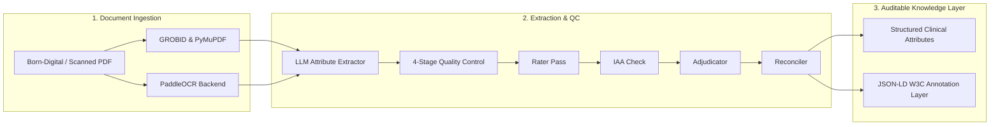

EviTrace is an automated research pipeline for extracting structured clinical and scientific attributes from complex PDF literature while ensuring **every extracted value is explicitly traceable** to the source evidence.

<!--more-->

### Architecture & Pipeline Overview



### Key Technical Features

- **Multi-Backend Ingestion:** Integrates GROBID, pdfplumber, PyMuPDF, and PaddleOCR, gracefully handling both born-digital articles and scanned clinical reports.
- **4-Stage Quality Control (QC):** Employs a multi-tier verification loop (*Rater $\rightarrow$ Inter-Annotator Agreement (IAA) $\rightarrow$ Adjudicator $\rightarrow$ Reconciler*) to eliminate single-model hallucination risks.
- **Evidence-Grounded JSON-LD Output:** Every extracted field includes character-level bounding boxes, page offsets, and confidence scores.

### Sample Auditable Output (JSON-LD)

```json
{
  "@context": "https://schema.org/",
  "@type": "MedicalStudy",
  "studySubject": "COVID-19 Survivors",
  "extractedAttribute": {
    "name": "Cost-effectiveness Ratio",
    "value": "$14,250 / QALY",
    "evidenceProvenance": {
      "pageNumber": 4,
      "boundingPolygon": [120, 340, 480, 370],
      "exactQuote": "The incremental cost-effectiveness ratio was calculated at $14,250 per QALY gained.",
      "confidenceScore": 0.982
    }
  }
}
```

Written in Python and released under the **GPL-3.0** license on [GitHub](https://github.com/soroushdty/EviTrace).
