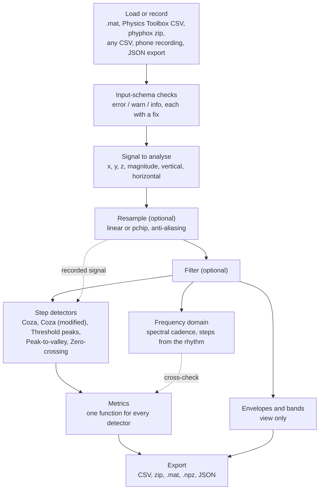

GaitScope is an interactive lab, in the browser, for learning how movement-sensor signals are processed. You record or load a walk from a phone's accelerometer, then filter it, look at its spectrum, and put several step detectors on the same plot to see where and why they disagree. There is nothing to install, and files never leave the browser.

**[Open GaitScope](https://soroushdianaty.com/gaitscope/)**

<!--more-->

---

## At a glance

| | |
|---|---|
| **Status** | Early development. Started 2026-09-23; version 0.1.0, no tagged release yet. Features still change from week to week. |
| **Role** | Maintainer: directs and reviews all work; code, tests and documentation largely written with Claude Code (Anthropic's AI coding assistant) — see [docs/contributions.md](https://github.com/soroushdty/gaitscope/blob/main/docs/contributions.md) |
| **Origin** | A class project in BME 598/494 *Wearable Devices for Sport, Health, and Wellness* (ASU, Dr. Aurel Coza), Fall 2026 |
| **Domain** | Wearable sensing, digital signal processing, education |
| **License** | MIT for now; a move to AGPL-3.0 is planned, pending the course instructor's permission for the port of the course detector ([#42](https://github.com/soroushdty/gaitscope/issues/42)) |
| **Repository** | [github.com/soroushdty/gaitscope](https://github.com/soroushdty/gaitscope) |
| **Live app** | [soroushdianaty.com/gaitscope](https://soroushdianaty.com/gaitscope/) |

---

## Why it exists

The course provides a MATLAB step-detection script, `LabStepDet_2025.m`, and a sample recording. Students may skip MATLAB and use an AI tool to run the code instead. GaitScope started there, with a Python port of the script and a browser dashboard to run it on other recordings.

Working through the script made a broader point visible. A step count depends on choices that are easy to miss: the sampling rate the code assumes, the threshold, which axis of the phone you analyse, where the phone sits on the body, and how ties and stray peaks are handled. GaitScope puts those choices on the screen, so a student can change one and see what happens to the steps.

---

## What it does

**Bring a walk.**
- Upload a MATLAB `.mat` file (v5 to v7.3), a Physics Toolbox Sensor Suite CSV export, a phyphox export zip, or any CSV with numbers in columns.
- Or record a walk on a phone with the browser's motion sensors, with no app to install. The page asks how many steps you counted and where the phone was, and compares your count with the detectors.
- Reopen a previous analysis from a GaitScope JSON export.

**Check the file.** Every file is checked against a documented [input schema](https://github.com/soroushdty/gaitscope/blob/main/docs/schema.md) before analysis. The rule is to be strict where bad input would give wrong numbers with no visible sign, and lenient where a person looking at the plot can judge. Each problem comes with a concrete fix, such as the MATLAB line to re-save a file in a readable format.

**Prepare the signal.**
- Pick x, y, z or the magnitude; when the recording includes gravity, also the vertical and horizontal acceleration.
- Resample to a chosen rate (linear or monotone cubic, with optional anti-aliasing).
- Filter: Butterworth, Bessel, Chebyshev I and II, elliptic, moving average, median, Savitzky–Golay, wavelet denoising and notch.

**Detect steps.** Detectors and envelopes work like indicators on a chart: any number on the plot at once, each with its own settings, colour and source signal (filtered or recorded), and its own metrics column.
- **Coza:** the course's detector, ported exactly as written.
- **Coza (modified):** a variant of the same detector. It counts tied peaks once, drops start and stop artefacts, uses a window in seconds and real timestamps, and reports cadence.
- **Threshold peaks, Peak-to-valley and Zero-crossing:** three textbook detectors, each credited to its source.
- **Envelopes and bands:** sliding window, peak-trough, dynamic threshold, mean ± k·SD, Hilbert envelope and percentile band. They are a view only and never change the steps.

**Read the results.**
- **Metrics** per detector: steps, step duration, cadence, step-time variability, gait asymmetry, walking span and harmonic ratio. All detectors' metrics come from the same function, working only from step times, so the columns compare directly.
- **Frequency domain:** a whole-recording view (Welch's spectrum, Lomb–Scargle, autocorrelation) and an over-time view (spectrogram, Morlet wavelet scalogram, wavelet bands, Hilbert–Huang spectrum). Walking shows as a peak, which gives a cadence without detecting any steps. That is an independent cross-check on the detectors.
- **Step intervals**, a **steps table**, and **notes** pinned to the plot or the spectrum ("turned around", "counted twice").

**Export** in the format each tool expects: CSV, a zip of CSVs, a MATLAB `.mat` struct, NumPy `.npz` (no pickle), or JSON, which reopens the whole analysis in GaitScope. Sample numbers are 1-based, as in MATLAB.

**Python port.** `python/lab_step_det.py` is a 1:1 translation of the course script. It reads the same file types and writes the same export layout.

---

## How the methods are checked

The repository separates three kinds of evidence and states the limit of each.

**1. The course detector matches the original script.** On the course's sample walk, the dashboard, the Python port and GNU Octave running `LabStepDet_2025.m` give identical steps and metrics on all three axes.
*Limit:* the course files are not in the repository, so this check runs only on a machine that has them, not in continuous integration. CI checks the same code on a synthetic walk.

**2. Each method agrees with an established library.** Test fixtures are generated by the reference implementation, and the tests compare against them on every pull request:

| Method | Reference | Tolerance |
|---|---|---|
| IIR filters (Butterworth, Bessel, Chebyshev I/II, elliptic) | scipy | 1e-9 |
| Moving average, median, Savitzky–Golay, wavelet denoising, notch | scipy, PyWavelets | 1e-9 |
| Resampling | the Python port (numpy, scipy) | linear bit for bit; cubic and anti-aliased 1e-12 |
| FFT, Welch, spectrogram | numpy, scipy | 1e-12 (relative) |
| Lomb–Scargle, autocorrelation | scipy, numpy | 1e-12, 1e-13 |
| Morlet wavelet transform, Daubechies-4 bands | PyWavelets | 1e-10 (relative), 1e-12 |
| Empirical mode decomposition | PyEMD | 1e-9 |

Every export format is read back with an independent reader (scipy, numpy, Python's `zipfile` and `csv`, and Octave when installed).
*Limit:* agreement is shown on test inputs. It is evidence that the code computes the intended method, not proof for every input.

**3. A few real walks with hand-counted steps.** On 2026-10-07 the maintainer recorded four walks with the dashboard and counted the steps: three on a Pixel 9a (10, 28 and 60 steps) and one on an iPad (24 steps). Inside the walk, Coza (modified), Threshold peaks, Peak-to-valley and Zero-crossing were within 2 of the count on the total acceleration and within 1 on the vertical. The unmodified Coza found 45 of 60 at the phone's rate of about 60 Hz, because its window is counted in samples and assumes 100 Hz; resampled to 100 Hz, it found all 60.
*Limit:* one person, two devices, a normal pace, two phone positions. That is too little to rank the detectors or to call any of them accurate.

---

## Signal pipeline

The browser app is a static page with no build step: plain JavaScript, with Plotly for the charts. The computational core (`src/core.js`) has no DOM access, so the same code runs under Node in the tests.

---

## Status and roadmap

Development started on 2026-09-23. The app is live and usable, but there is no tagged release yet and behaviour still changes. The plan lives in the [issue tracker](https://github.com/soroushdty/gaitscope/issues). The main open threads:

- **Licence and purpose:** move to AGPL-3.0 and settle the educational aim, after the instructor's permission ([#42](https://github.com/soroushdty/gaitscope/issues/42), [#67](https://github.com/soroushdty/gaitscope/issues/67)).
- **More counted walks:** a back pocket, slow and fast walks, other people, and an iPhone, which has not been tested yet ([#68](https://github.com/soroushdty/gaitscope/issues/68), [#51](https://github.com/soroushdty/gaitscope/issues/51)).
- **A citable release:** tag v0.1.0 and archive it on Zenodo for a DOI ([#113](https://github.com/soroushdty/gaitscope/issues/113)). Until then, cite the software through its `CITATION.cff`, with the version used.
- **An optional tutor:** research into what a language-model tutor running in the browser would cost, and whether small models are good enough ([PR #59](https://github.com/soroushdty/gaitscope/pull/59), [#111](https://github.com/soroushdty/gaitscope/issues/111)).
- **Plugins** for user-supplied detectors, envelopes and filters ([#64](https://github.com/soroushdty/gaitscope/issues/64)).

---

## What it is, and what it isn't

- **It is a teaching and exploration tool.** It is for students and instructors who want to see what a filter, a spectrum or a step detector does to a real signal, and why two detectors disagree.
- **It is not a validated gait-measurement instrument.** Step counts, cadence and the other metrics have been compared with hand-counted steps on a few walks by one person, nothing more. They have not been validated across people, devices or walking conditions, or against a reference system such as an instrumented walkway.
- **It is not for clinical use.** Do not use it to diagnose, monitor or make decisions about anyone's health.

Other known limits:
- Phone recording needs https and the screen on. Browsers stop sending motion data when the screen locks, so a recording ends there ([#86](https://github.com/soroushdty/gaitscope/issues/86)).
- Whether each peak is a step or a stride depends on the axis and where the phone is carried; how the page should decide is still under investigation ([#89](https://github.com/soroushdty/gaitscope/issues/89)).
- The Python port covers only the course detector; the other detectors and the harmonic ratio are not ported yet ([#73](https://github.com/soroushdty/gaitscope/issues/73)).
- The page loads its charting libraries from a CDN, so it needs an internet connection.

---

## Use in teaching

GaitScope is built for the questions a signal-processing or wearables lab tends to raise: what does this filter remove, why does the spectrum show a peak at half the step rate, why does the same detector find different steps at 60 Hz and 100 Hz. Each method shows its settings and credits its authors, with a DOI where one exists, on the page and in exports.

Its use in a course has not been settled. How the educational side will work is still to be decided ([#42](https://github.com/soroushdty/gaitscope/issues/42)), and questions to the course instructor, including whether a Python version is acceptable for submissions, are open ([#67](https://github.com/soroushdty/gaitscope/issues/67)). Students taking BME 598/494 are asked to check the course's rules before contributing, since a contribution may count as shared work on an assignment.

---

## Credits

- **Coza** and the course's sample walk come from BME 598/494 *Wearable Devices for Sport, Health, and Wellness* (ASU, Dr. Aurel Coza). The course files are not in the repository; the detector is ported and credited to Dr. Coza.
- **Coza (modified):** Soroush Dianaty.
- **Every other method** credits its authors on the page and in exports; the full list is under Credits in [docs/algorithm.md](https://github.com/soroushdty/gaitscope/blob/main/docs/algorithm.md).
- **Who did what**, including the use of AI, is recorded in [docs/contributions.md](https://github.com/soroushdty/gaitscope/blob/main/docs/contributions.md).

---

## Related work on this site

- [Wearable Biosignals & Cardiovascular Modeling](/research/#wearable-biosignals): the research pillar on wearable sensor data. GaitScope is a teaching tool rather than part of that research, but it works with the same kind of signal.
