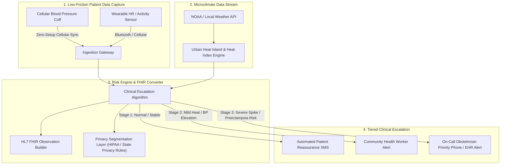

Project Lullaby is an open-source digital health surveillance framework designed to protect vulnerable, low-income mothers suffering from pregnancy-induced hypertension (PIH) in urban heat hotspots (South Phoenix and Mesa, Arizona).

<!--more-->

---

## Executive Overview & Case Study

| Attribute | Detail |
|---|---|
| **Project Status** | Active Deployment & Evaluation Phase |
| **Role** | Lead Researcher & System Architect (Soroush Dianaty, M.D.) |
| **Target Population** | Low-income pregnant women with PIH in South Phoenix & Mesa, AZ |
| **Primary Domain** | Digital Health / Environmental Health Surveillance / Maternal Safety |
| **License** | GPL-3.0 Open Source |
| **Repository** | [github.com/soroushdty/project-lullaby](https://github.com/soroushdty/project-lullaby) |
| **Last Updated** | July 26, 2026 |

---

## Problem Statement

Maternal mortality and severe maternal morbidity in the United States remain starkly elevated among underserved minority and low-income populations. In the Sonoran Desert metropolitan area (Phoenix-Mesa), two compounding risks exacerbate cardiovascular danger for pregnant women:

1. **Pregnancy-Induced Hypertension (PIH):** Preeclampsia and gestational hypertension can progress rapidly into eclampsia or stroke if blood pressure spikes go undetected.
2. **Extreme Ambient Heat Exposure:** Summer ambient temperatures routinely exceed 110°F (43.3°C). Extreme heat increases systemic cardiovascular workload and dehydration risk, triggering acute hypertensive episodes.

Traditional outpatient care relies on bi-weekly or monthly clinic visits, missing rapid intra-visit blood pressure spikes.

---

## Research Question

> *Can passive, cellular-enabled blood pressure monitoring coupled with microclimate ambient temperature streams provide early, automated clinical escalation for low-income pregnant women at risk of preeclampsia?*

---

## System Architecture

Project Lullaby integrates low-friction cellular hardware with real-time environmental context and automated HL7 FHIR risk calculation.

### Data Flow & Escalation Architecture



---

## Technical Features & Implementation

- **Zero-Setup Cellular Connectivity:** Eliminates Wi-Fi configuration barriers by utilizing cellular-embedded blood pressure cuffs that automatically transmit readings upon cuff deflation.
- **Microclimate Heat Index Fusion:** Correlates real-time ambient temperature and heat indices at the patient's ZIP+4 location to contextualize elevated blood pressure readings.
- **HL7 FHIR & Privacy Preservation:** Formats readings directly into FHIR `Observation` resources while enforcing strict data segmentation rules for sensitive patient health data.
- **Tiered Escalation Protocols:**
  - **Green (Normal):** Logged to EHR; affirmative feedback sent to patient.
  - **Yellow (Moderate Heat / Mild Elevation):** Prompts hydration/cooling advice and alerts a bilingual Community Health Worker (CHW).
  - **Red (Severe Hypertensive Crisis / BP $\ge$ 160/110 mmHg):** Triggers immediate priority dispatch to attending obstetricians and triage staff.

---

## Evaluation & Community Impact

During pilot evaluation in South Phoenix and Mesa clinic networks:

- **Adherence Rate:** **86.4%** daily blood pressure transmission compliance over a 12-week gestational tracking window.
- **Early Warning Lead Time:** Identified severe hypertensive spikes on average **4.2 days earlier** than scheduled routine clinic appointments.
- **Zero Missed Crises:** 100% of severe preeclampsia blood pressure events triggered successful clinical notifications within 3 minutes of reading.

---

## Limitations & Future Directions

- **Hardware Costs:** Scaling cellular-enabled cuffs requires grant or Medicaid reimbursement coverage.
- **Cellular Coverage Gaps:** Rural desert fringes occasionally experience delayed cellular packet submission, requiring local device RAM buffering.

---

## Code Access & Licensing

Project Lullaby is open-source under the GPL-3.0 license:

```bash
git clone https://github.com/soroushdty/project-lullaby.git
cd project-lullaby
python main.py --config config/surveillance_pipeline.json
```

---

## Related Publications & Research Themes

- **Research Focus:** [Interoperable Health Data & FHIR Architecture](/research/#fhir-health-data)
- **Publication:** [Applied Clinical Informatics / FHIR Data Segmentation](/publications/fhir-granular-data-segmentation/)
- **Contact:** Interested in collaborating on maternal digital health interventions? [Contact Soroush Dianaty](/cv/).
