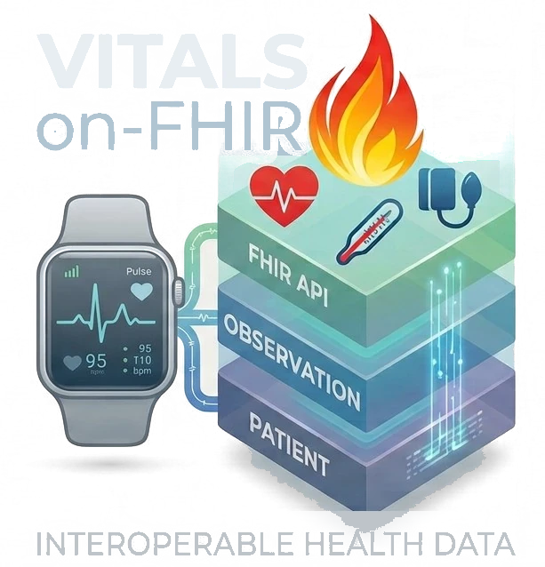
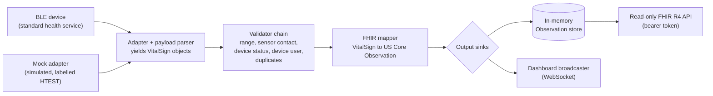

Many consumer wearables and home health devices keep their data inside vendor apps, yet many of them also speak open Bluetooth health standards. vitals-on-fhir reads vital signs from those open channels and exposes them as HL7 FHIR R4 Observations that follow the US Core vital-signs profiles, so any FHIR-capable system can use them without a device-specific integration. It currently covers heart rate, blood pressure, oxygen saturation, body temperature, and body weight.

<!--more-->

<div class="not-prose flex justify-center my-6">
  
  
</div>

---

> **Not a medical device.** vitals-on-fhir is a research and educational proof-of-concept for healthcare interoperability. It is not for diagnosis, treatment, or any clinical decision-making. It is not HIPAA-compliant, keeps data in memory only, and is not designed for untrusted networks.

---

## At a glance

| | |
|---|---|
| **Status** | Early development, version 0.1.0 (no tagged release yet). Heart rate is tested on one real device; the other four vital signs are tested without hardware. |
| **Role** | Maintainer and developer. Started as a BMI 540 team project at Arizona State University (team: Soroush Dianaty, MD; Nusrat Ashrafi, MS; Isha Uttham, BS; instructor: Sheetal Shetty, PhD). Developed spec-first, with Claude (via Claude Code) as author or co-author of most commits. |
| **Domain** | Health interoperability, patient-generated health data, Bluetooth health devices |
| **License** | GNU AGPL-3.0-or-later |
| **Repository** | [github.com/soroushdty/vitals-on-fhir](https://github.com/soroushdty/vitals-on-fhir) |

---

## Problem

Wearables and home devices such as blood-pressure cuffs, pulse oximeters, thermometers, and scales produce data that patients and caregivers might want in a health record or a research pipeline. Usually that data reaches other systems only through each vendor's app and cloud. Building one integration per device does not scale.

Many of these devices also support standard Bluetooth Low Energy health services defined by the Bluetooth SIG, such as the Heart Rate Service and the Blood Pressure Service. FHIR, US Core, LOINC, and UCUM already define how vital signs should look in a health record. What is missing is a small, inspectable piece that connects the two: it reads the open Bluetooth channel and produces FHIR that validates.

The repository's standards review also raises a second problem. Data that a patient collects at home should not look the same as vital signs recorded by a clinician, and simulated data should never be mistaken for real measurements.

---

## Approach

- **Open channels only.** The project reads only standard Bluetooth health services and documented formats. Proprietary or reverse-engineered protocols are permanently out of scope. Every payload parser cites the Bluetooth SIG specification it implements.
- **The bridge, not the app.** The core takes in readings and produces FHIR. The dashboard is a demonstration consumer of the FHIR API. Analytics and clinical decision support are out of scope.
- **Metadata-driven mapping.** Each vital-sign class declares its LOINC codes, UCUM unit, and US Core profile. Generic mappers build the Observation from that metadata, so adding a vital sign needs no new mapper code.
- **Careful with device-reported context.** Measurement time, the thermometer's body site, readings the device flags as unreliable, and which user of a shared cuff or scale took the reading are each either kept or acted on. Each choice is recorded in a decision record.
- **Checked against the standard.** An Observation from each simulated adapter was last checked by hand with the HL7 FHIR validator (6.10.4) against US Core 9.0.0, with no errors. Adding this check to CI is an open issue.

---

## Architecture



1. An **adapter** connects to one device and yields immutable vital-sign objects. Adapters do not import FHIR code. One shared Bluetooth connection helper handles scanning, subscribing, and reconnecting for every standard service.
2. A **validator chain** accepts or rejects each reading. Rejections are logged without the measurement value.
3. A **FHIR mapper** turns each accepted reading into an R4 Observation from the class metadata. A registry chooses the mapper by type, with one mapper for single-value vital signs and one for multi-component vital signs such as blood pressure.
4. **Sinks** receive each Observation: an in-memory store behind the read-only API, and a broadcaster that pushes it to the dashboard.

Every extension point is an abstract base class: vital-sign types, adapters, parsers, validators, mappers, stores, sinks, and authenticators. A third-party adapter can be selected by its import path without changing the repository. Tests that parse every module enforce the package boundaries, so adapters cannot import FHIR code, for example.

**FHIR API (read-only).** `GET /fhir/metadata`, `/fhir/Observation` (search by `code`, `date`, `_sort=-date`, `_count`), `/fhir/Observation/{id}`, `/fhir/Patient/{id}`, and `/fhir/Device/{id}`. Responses use `application/fhir+json`, and searches return `searchset` Bundles. Token and date search follow FHIR semantics, including date precision and the `eq`/`ge`/`gt`/`le`/`lt` prefixes.

**Dashboard.** A local web page shows safety notes and asks for the token on its start page. It then shows the live heart rate, the source device, the connection status with the reason when no device is connected, a scrolling heart-rate chart, and each reading as the FHIR Observation the server produced. With the mock adapter, it can also simulate heart-rate patterns such as sinus rhythm, atrial fibrillation, SVT, an exercise ramp, an off-wrist sensor, or a disconnect. These imitate heart *rate* only, with no ECG.

---

## Supported vital signs

| Vital sign | Bluetooth service | Adapters (real / simulated) | LOINC | UCUM | US Core 9 profile |
|---|---|---|---|---|---|
| Heart rate | Heart Rate `0x180D` | `miband10` / `mock` | `8867-4` | `/min` | Heart Rate |
| Blood pressure | Blood Pressure `0x1810` | `bp` / `mock-bp` | `85354-9` panel; `8480-6` systolic, `8462-4` diastolic | `mm[Hg]` | Blood Pressure |
| Oxygen saturation | Pulse Oximeter `0x1822` | `spo2` / `mock-spo2` | `59408-5` and `2708-6` | `%` | Pulse Oximetry |
| Body temperature | Health Thermometer `0x1809` | `temp` / `mock-temp` | `8310-5` | `Cel` | Body Temperature |
| Body weight | Weight Scale `0x181D` | `weight` / `mock-weight` | `29463-7` | `kg` | Body Weight |

- **Hardware status.** Heart rate is tested on a Xiaomi Smart Band 10. The cuff, oximeter, thermometer, and scale adapters follow the Bluetooth specifications and pass hardware-free tests, but none has been tried with a specific device yet.
- Units are normalized: kPa to mmHg, °F to °C, and pounds to kilograms. Mean arterial pressure is not modelled because the device calculates it rather than measuring it directly.
- For oxygen saturation, only the continuous-measurement stream is read. Spot-check measurements are deferred.
- The default range limits only reject values a living body cannot produce, such as 20–250 bpm or 10–47 °C. They are not clinical thresholds.

---

## Design decisions

The project records its decisions as ADRs (architecture decision records) and records findings in briefs before deciding.

- **ADR-0001: Open phase 2 (home health devices).** The four new vital signs were delivered one spec at a time, with blood pressure first because it was the first multi-component vital sign. Components are typed class metadata, so the domain model stays FHIR-free. The Bluetooth lifecycle is shared through composition, not another level of inheritance. SMART on FHIR and durable storage were deliberately deferred because the project has no remote or multi-user deployment to protect yet.
- **ADR-0002: Mark patient-generated and simulated data.** Every Observation sets `performer` to the Patient and adds the HL7 Personal Health Device IG's `phd` category next to `vital-signs`. Simulated readings and their Device carry the `HTEST` security label. Each candidate marker was run through the HL7 validator first. The proposed US Core `patient-supplied` tag was not used because it produced validation errors against the published code system.
- **ADR-0004: Shared cuffs and scales.** Multi-user devices tag each reading with a user ID. The service records only the configured user's readings, and by default it rejects every reading from a multi-user device until that user is set. The ID is compared and then discarded. It is never logged, stored, or put into FHIR.
- **ADR-0005: Honour device-reported status.** Blood-pressure and oximeter readings that the device marks as invalid, questionable, or not final are rejected rather than published as `final`. A cuff's "irregular pulse" flag is accepted because it is a clinical finding, not a faulty reading. Rejecting it would drop every reading from a person with atrial fibrillation.
- **ADR-0006: Temperature measurement site.** The thermometer's reported site goes into `Observation.bodySite` as a SNOMED CT concept. The site is never guessed: "Body (general)" or a missing field gives no `bodySite`.
- **Brief: validation modes.** If personal or clinical thresholds are added later, they should flag readings, for example through `interpretation`, and never drop them. An abnormal but real reading is the one a caregiver most needs to see.

ADR-0003 is reserved for a planned session capture and review feature, which is currently a brief. A standards-alignment brief compares the project with published guidance on bringing patient-generated data into EHRs (Dinh-Le et al., 2019; the IFCC C-MHBLM recommendations, 2024), the HL7 Personal Health Records IG, and SMART App Launch. The gaps it found became tracked issues, and most of them led to the ADRs above.

---

## Getting started

Requirements: Python 3.12+, [uv](https://docs.astral.sh/uv/), and a Bluetooth LE adapter only if you use a real device.

```bash
git clone https://github.com/soroushdty/vitals-on-fhir.git
cd vitals-on-fhir
uv sync
uv run vitals-on-fhir            # demo mode: simulated heart rate, no token needed
```

Then open `http://127.0.0.1:8000/`. Other simulated vital signs use `--adapter mock-bp`, `mock-spo2`, `mock-temp`, or `mock-weight`.

A real device always requires a token. Set `VOF_API_TOKEN` in `.env` (copy it from `.env.example`), enable heart-rate broadcast on the band, and run:

```bash
uv run vitals-on-fhir --adapter miband10
```

To query the API:

```bash
curl -H "Authorization: Bearer $VOF_API_TOKEN" \
  "http://localhost:8000/fhir/Observation?code=http://loinc.org|8867-4&_sort=-date&_count=10"
```

Development checks: `uv run pytest` (hardware-free suite), `uv run pytest -m hardware` (needs a real band), `uv run ruff check .`, and `uv run mypy src`. CI runs lint, a format check, strict type checks, and the hardware-free tests on every pull request.

---

## Status and roadmap

The project is young. The first commit is from 21 September 2026, and the most recent changes are from 8 October 2026.

1. **Heart rate from wearables:** delivered.
2. **Home health devices** over standard Bluetooth profiles: in progress. All four vital signs (blood pressure, SpO2, temperature, weight) have shipped.
3. **Phone health aggregators** (Android Health Connect, Apple HealthKit): planned. This would be the route for devices with proprietary Bluetooth.
4. **Persistence and outbound integration** (durable storage, pushing to external FHIR servers, SMART on FHIR): planned. TLS, audit logging, and encryption at rest are listed as prerequisites.
5. **Additional adapters** as separately licensed packages: planned.

Each later phase is opened by its own decision record.

The project plans a preprint. The open work toward it includes running the HL7 validator in CI, measuring from git history what each new vital sign took to add, measuring device-to-Observation latency, documenting the development method (including AI assistance), and tagging a citable v0.1.0 release. None of these measurements exist yet.

---

## Limitations and safety

- **Not a medical device.** Research and education only. Not for diagnosis, treatment, or clinical decisions. The simulated heart-rate scenarios are not a diagnosis.
- **Not for real patient data in production.** It is not HIPAA-compliant and has no TLS, audit log, or encryption at rest. It binds to `127.0.0.1` by default.
- **Bluetooth is unauthenticated.** While heart-rate broadcast is on, any nearby device can read the stream. Turn broadcast off when you are not using it.
- **Limited hardware testing.** Only heart rate has been tested on a real device, the Xiaomi Smart Band 10. The other four adapters have not yet been tried with real devices.
- **Standard-channel limits.** The service receives live data only, with no stored history. Wearables send device-computed beats per minute, not raw PPG. Some devices need a workout mode for broadcast. Apple Watch, Oura, and most Wear OS watches have no open real-time channel.
- **Scope.** The service reads one device at a time, for one local patient, and keeps data in memory only, so data is lost on restart.

---

## Related work on this site

- [Wearable biosignals research](/research/#wearable-biosignals): this project handles the interoperability side of consumer wearable data, getting device readings into a standard record format. It does not process signals and works with device-computed values, not waveforms.
- [Interoperable health data research](/research/#fhir-health-data): the same FHIR, LOINC, and SNOMED CT foundations, applied here to patient-generated vital signs.
- [FHIR-based granular data segmentation](/publications/fhir-granular-data-segmentation/) and [FHIR Data Segmentation for Non-FHIR Engineers](/blog/fhir-data-segmentation-primer/): both rely on FHIR `meta.security` labels. vitals-on-fhir uses the same mechanism to label simulated data as test data (`HTEST`).
- [GaitScope](/projects/gaitscope/): a related educational tool for consumer sensor data. It covers movement-sensor signal processing in the browser.
